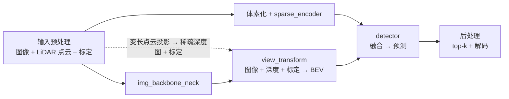

# BEVFusion NPU Demo 性能分析报告

> **报告导读**：
> - **§1 当前 demo 性能**：0.54s/帧（2026-09-21 npu:0 实测，轨迹 / bev_pool A/B / view_transform 明细）
> - **§2 全量数据集性能**：mAP 68.67 / NDS 71.49
> - **§3 优化总结**：已完成优化 + 剩余方向
> - **§4 历史 profiling 存档**：2026-09-17 output-profiling-1/2 msprof 采集分析，数据已过时
>
> 代码状态：2026-09-17 算子修复（voxelization/_downsample_coords 向量化、spconv 表共享、
> QuickCumsum kept bug 修复）+ bev_pool 分发修复（auto 默认 AscendC）；
> 2026-09-18 + O3 热点消除（NonZero/Unique/Index）+ get_geometry numpy 副本预计算 + bev_pool 包装层快赢（0.62s/帧）；
> 2026-09-21 demo.py 复用 `mmdet3d.apis.init_model` / `inference_multi_modality_detector`（与 multi_modality_demo 同通路），
> npu:0 实测 0.54s/帧（npu:7 共享设备噪声 ~0.70s，A/B 须同卡同时段）

## 一览

**当前 E2E：0.54 s/帧**（`[TIME] inference` 口径 = `model.test_step` 纯前向，
不含图像/点云加载与权重加载；2026-09-21 npu:0 实测 5 轮，533-539ms；共享设备 npu:7 同日实测 672-737ms，
跨卡/跨时段不可直接比，A/B 须同卡同时段）。

> **2026-09-21 demo.py 计时口径勘误**：`build_data` 复用 `inference_multi_modality_detector` 后，
> 数据构建阶段内部会额外跑一次 `model.test_step`（相当于 warmup 第 0 轮，发生在 `[unum_ops] warmup` 计时
> 区段**之前**）。`[TIME] inference` 计时仍只含计时循环内的纯前向，口径与历史数据完全一致；整体 wall time
> 比文档同期略多一次前向（约 +0.6s，一次性）。

优化轨迹：**57s 初版 → 1.1s（算子向量化）→ 0.7s（O3 热点消除）→ 0.66s（get_geometry numpy 副本预计算）→ 0.63s（bev_pool 包装层快赢）→ 0.62s（移除 x/y 交换）→ 0.54s（2026-09-21 npu:0 实测）**，详见 §1.1。

下表为完整管线一览，Pipeline 列标注各阶段执行方式。数据流关系：



<table>
  <thead>
    <tr>
      <th>Pipeline</th>
      <th>Layer</th>
      <th>作用</th>
      <th>算子</th>
      <th>性能</th>
      <th>性能占比</th>
    </tr>
  </thead>
  <tbody>
    <tr>
      <td rowspan="2"><b>输入预处理</td>
      <td rowspan="2">输入预处理</td>
      <td>图像加载 / 归一化；6 相机 → (1,6,3,256,704)</td>
      <td>torchvision, numpy</td>
      <td>test_step 口径外 (CPU)</td>
      <td>—</td>
    </tr>
    <tr>
      <td>LiDAR 投影；点云 → 稀疏深度图 (1,6,1,256,704)<br>（DepthLSSTransform.forward 循环段）</td>
      <td>matmul, indexing（Python 循环 b×6）</td>
      <td>~77 ms</td>
      <td>14%</td>
    </tr>
    <tr>
      <td rowspan="2"><b>img_backbone_neck</td>
      <td rowspan="2">img_backbone_neck</td>
      <td>Swin-B Backbone；多尺度特征提取</td>
      <td>Conv2D, LayerNorm, SwiGLU, GELU</td>
      <td>~177 ms</td>
      <td>33%</td>
    </tr>
    <tr>
      <td>FPN Neck；多尺度融合 → (1,6,256,32,88)</td>
      <td>Conv2D, Upsample, Concat</td>
      <td>~6 ms</td>
      <td>1%</td>
    </tr>
    <tr>
      <td rowspan="6"><b>view_transform</td>
      <td>get_geometry</td>
      <td>相机视锥投影到 LiDAR 系坐标</td>
      <td>Inv3×3, MatMul(≥6D→bmm)</td>
      <td>~5 ms (H2D；CPU 预计算消除 D2H 排干)</td>
      <td>1%</td>
    </tr>
    <tr>
      <td>dtransform</td>
      <td>稀疏深度特征提取 → (6,64,32,88)</td>
      <td>Conv2D(1→8→32→64 s4/s2), BN, ReLU</td>
      <td>~4 ms</td>
      <td>1%</td>
    </tr>
    <tr>
      <td>depthnet</td>
      <td>深度估计 + 语义特征；深度⊕图像 → (6,121,32,88): 41bin+80feat</td>
      <td>Conv2D(320→256→256→121), Softmax</td>
      <td>~4 ms</td>
      <td>1%</td>
    </tr>
    <tr>
      <td>bev_pool</td>
      <td>特征聚合到 BEV 网格；按坐标累加 → (1,3280,180,180)</td>
      <td>免排序原子加 scatter（unum_ops AscendC）</td>
      <td>~31 ms（ranks 2.5 + op 19.7 + permute 6.4）</td>
      <td>6%</td>
    </tr>
    <tr>
      <td>downsample</td>
      <td>BEV 下采样；3 层 Conv 下采样→ (1,80,180,180)</td>
      <td>Conv2D, BN, ReLU</td>
      <td>~5 ms</td>
      <td>1%</td>
    </tr>
    <tr>
      <td>—</td>
      <td>view_transform 整体（forward 含上述全部 + 调度）</td>
      <td>—</td>
      <td><b>~126 ms</b></td>
      <td>23%</td>
    </tr>
    <tr>
      <td rowspan="2"><b>体素化 + sparse_encoder</b><br/>（img 分支后串行，bevfusion.py:272）</td>
      <td>voxelize</td>
      <td>点云 → 体素坐标</td>
      <td>argsort, unique_consecutive</td>
      <td>~72 ms <b>(Sort AICPU 39)</b></td>
      <td>13%</td>
    </tr>
    <tr>
      <td>sparse_encoder</td>
      <td>Voxel 特征提取</td>
      <td>SubMConv3D, SparseConv3D</td>
      <td>~121 ms</td>
      <td>23%</td>
    </tr>
    <tr>
      <td rowspan="4"><b>detector</td>
      <td>fusion</td>
      <td>特征融合；img_feat ⊕ pts_feat → 融合 BEV</td>
      <td>Conv2D, ScatterND→Pad(优化)</td>
      <td>~4 ms</td>
      <td>1%</td>
    </tr>
    <tr>
      <td>backbone</td>
      <td>BEV 骨干；时空特征提取</td>
      <td>Conv2D, BN, ReLU</td>
      <td>~9 ms</td>
      <td>2%</td>
    </tr>
    <tr>
      <td>neck</td>
      <td>FPN；多尺度特征</td>
      <td>Upsample, Conv2D</td>
      <td>~5 ms</td>
      <td>1%</td>
    </tr>
    <tr>
      <td>head</td>
      <td>检测头；center/height/dim/rot/vel/heatmap/query_labels</td>
      <td>Conv2D, TopK, Scatter, Mod→cast int32</td>
      <td>~18 ms</td>
      <td>3%</td>
    </tr>
    <tr>
      <td><b>后处理</b></td>
      <td>后处理</td>
      <td>top-k + 解码；原始预测 → 3D bbox<br>（无 box NMS，TransFusion decoder query 自带去重）</td>
      <td>PyTorch 算术</td>
      <td>~8 ms (CPU)</td>
      <td>—</td>
    </tr>
    <tr>
      <td colspan="3"><b>合计（串行探针口径，NPU 侧）</b></td>
      <td>—</td>
      <td><b>≈537 ms；E2E 实测 533-539 ms</b></td>
      <td>100%</td>
    </tr>
  </tbody>
</table>

> **数据口径**（2026-09-21，当前代码，npu:0，E2E 0.54s/帧，48 dets）：稳态探针 n=5（各阶段
> forward hook 计时，**每段后 synchronize 的串行口径**，逐段同步开销已含入各段）。
> 模块级数值为实测：pts_voxel_layer 72 / pts_middle_encoder 121 / img_backbone 177 / img_neck 6 /
> view_transform 126（内部：LiDAR 投影 ~77 + get_geometry ~5 + dtransform 4 + depthnet 4 +
> bev_pool ~31 + downsample 5）/ fusion 4 / pts_backbone 9 / pts_neck 5 / bbox_head 18，合计 ≈537ms；
> E2E 实测 533-539ms（探针同步开销下 sum 与 E2E 吻合）。**占比按 537ms 计**。
> LiDAR 投影/bev_pool 为内部估算拆分（view_transform 整体 126ms 实测，子模块 hook 得
> dtransform/depthnet/downsample，bev_pool 按 §1.3 全链 31.4ms 计，剩余归 LiDAR 投影）。
> 后处理 CPU 侧 ~8ms 不计入 NPU 占比。

**一览表关键结论**：

1. **前三大耗时**：img_backbone 33%（~177ms）> view_transform 整体 23%（~126ms，含 LiDAR 投影）> sparse_encoder 23%（~121ms）
2. **bev_pool 已是次要项**：原子加 kernel 全链 ~31ms（ranks 2.5 + op 19.7 + permute 6.4），
   不再是最优优化靶——LiDAR 投影（~77ms）与 voxelize Sort AICPU（~39ms）才是剩余大头
3. **get_geometry CPU 补丁已基本免费**：numpy 副本预计算后仅 ~5ms H2D，D2H 排干已消除
   （精度/性能三方 A/B 见 §1.3）
4. **AICPU 残留 ~39ms/帧**：voxelize Sort（voxelize 72ms 中的 Sort 段，argsort int32 落 AICPU）
5. **数据搬运/布局风暴仍在**：Swin/BEV/spconv 链路的 gather/scatter/transpose 小算子风暴
   是 310P 主战场（详见 §5 profiling 复盘）

## 1. 当前 demo 性能（2026-09-21 更新）

### 1.1 累计优化轨迹（demo 单帧）

| 版本 | inference | 检测 |
|---|---|---|
| NPU 初版（Python 循环算子） | 57-61s | 48 / 0.8195 |
| 算子向量化修复 | 2.2s | 48 / 0.8195 |
| + bev_pool 分发修复（QuickCumsum） | 1.0-1.3s | 48 / 0.8193 |
| + bev_pool AscendC（auto 默认） | 0.9-1.2s | 48 / 0.8195 |
| **+ 消除 NonZero/UniqueWithCountsExt2/Index 热点（O3）** | **0.7s（3/3 轮）** | **48 / 0.819478（逐检测 diff ≤1e-4）** |
| **+ get_geometry numpy 副本预计算（`patch_get_geometry_overlap`）** | **0.66s（653-660ms, 5/5 轮）** | **48 / 0.819478（几何与纯 CPU 补丁逐位一致）** |
| **+ bev_pool 包装层快赢（cat 交换/int32 ranks/sort 一次性/int32 gather）** | **0.63s（631-639ms, 5/5 轮）** | **48 / 0.819399（噪声内；包装 78→48ms）** |
| **+ 移除 x/y 交换（unum_ops kernel 回退 3c7c9bd + 官方约定，分发器直用原生坐标）** | **0.62s（613-618ms, 3/3 轮）** | **48 / 0.819478（逐位一致）** |
| + mx_driving bev_pool_v3 试用（后端可选） | 0.58s（当日环境） | 48 / 0.819399 |
| **+ unum_ops 原子加 bev_pool（免排序 scatter 重写，auto 默认）** | 同条件 A/B 比 mx 快 ~33ms（2026-09-20 当日环境 E2E 753 vs 786ms，两日后绝对值见当日设备状态） | **48 / 0.819399（逐位一致）** |
| **2026-09-21 npu:0 复测（重构后当前代码）** | **0.54s（533-539ms, 5/5 轮，npu:0）** | **48 / 0.640（npu:7 同期 672-737ms，检测一致）** |

> 2026-09-20 注：当日整机环境比 09-18 慢 ~150-200ms（mx_driving 同条件复测也 ~790ms），
> E2E 绝对值跨日不可比；同日 A/B：unum_ops 原子版 753ms vs mx_driving 786ms。
>
> 2026-09-21 注：npu:0 实测 0.54s 为当前最佳；npu:7 共享设备受其他逻辑设备争抢（±0.2s），
> 同一命令跨卡测出 0.70s。绝对值对比必须同卡同时段。

### 1.1.1 unum_ops 原子加 bev_pool kernel（2026-09-20 重写）

**算法**（对标 mx_driving 的算法级优势，消除排序/收集/区间构建流水线）：
- host 预乘元素偏移 ranks `off = (((b*D+z)*H+x)*W+y)*C`（int32 精确，实测 321M 逐位正确）
- kernel 逐点：标量读 rank → OOB（`off ≥ gridTotal*C`）零写流量跳过 → `SetAtomicAdd<float>` +
  80-float `DataCopy` 直写 BEV cell（MTE3 原子累加）→ `SetAtomicNone`（mx 同款逐点切换）
- tile 间 `PipeBarrier<PIPE_ALL>` 串行纪律（沿用旧 segment-sum kernel 验证过的 MTE2→标量门控；
  首版整块原子提升 + ping-pong 事件会间歇性挂死 310P，transposed kernel 背锅，已废弃）
- **NPU 大 int32 坑（重要）**：≥2^28 的 int32 过 `torch.where`/比较算子会被内部 FP32 量化
  （268435455→268435456，`269567999 < 269568000` 判 False）。OOB 修正改用小值域判定：
  坐标逐维 `<W/<H/<D` 生成 mask + 小值 where 把越界点 batch 列置为 B（rank 自然 ≥ 上界被
  kernel 跳过），全程不触碰大值 where/比较

**实测（1.84M 点，B=1, D=41, H=W=180, C=80）**：

| 指标 | unum_ops 原子版 | mx_driving v3 | QuickCumsum |
|---|---|---|---|
| 全链总耗时 | **31.4ms** | 34.4ms | 399ms |
| ranks 预处理 | 2.5ms | 4.0ms | — |
| op 调用（zeros+kernel） | **19.7ms** | 24.4ms | — |
| 输出 permute | 6.4ms | 9.0ms | — |
| 对 CPU 参考精度 max_abs | **4.8e-7** | 1.95e-5 | ~1e-6 |
| OOB 点处理 | kernel 内零写流量跳过 | 需 host sanitize（乘 0 仍写 320B/点） | kept 过滤 |

- kernel 单体 ~17.2ms vs mx 21.9ms（**快 21%**，主因 OOB 点零写流量——30% 点不产生 MTE3 负载）
- 稳定性：15/15 独立进程（kernel only / kernel+transpose / 完整 wrapper）
- 多 batch 正确性：B=1/2/3、gridTotalC 高至 321M（跨 2^28 边界）全对（修复大 int32 where 量化后）

⚠️ 全量精度回归（2026-09-18，AscendC 默认）：**mAP 68.67 / NDS 71.49**，与 QuickCumsum
差异 ≤0.004，与 GPU 基线差异在噪声内，精度无退化（详见 [`精度.md`](精度.md) §1.3）。

### 1.2 bev_pool 后端 A/B（环境变量 `BEVFUSION_BEV_POOL_BACKEND`，同帧同参，各 4 轮；O3/get_geometry 预计算之前测量，E2E 为当时值，段间相对差仍成立）

> 后端选择统一走环境变量（`bevfusion/ops/__init__.py` 读取，默认 `auto`）：
> ```bash
> BEVFUSION_BEV_POOL_BACKEND=auto        python demo.py ...   # 默认：CUDA→unum_ops 原子加→mx_driving→QuickCumsum
> BEVFUSION_BEV_POOL_BACKEND=torch       python demo.py ...   # QuickCumsum（参照/精度对比）
> BEVFUSION_BEV_POOL_BACKEND=scatter     python demo.py ...   # scatter_add（bit-exact 但 AICPU 慢）
> BEVFUSION_BEV_POOL_BACKEND=mx_driving  python demo.py ...   # DrivingSDK bev_pool_v3（对照）
> ```

| 后端 | inference 各轮 | 典型值 | bev_pool 段 |
|---|---|---|---|
| **unum_ops 原子加（auto 默认，2026-09-20 重写）** | 0.73-0.77s（当日环境） | **31.4ms 全链** | ~31ms |
| mx_driving v3 | 0.77-0.81s（当日环境） | 34.4ms 全链 | ~34ms |
| AscendC segment-sum（旧版，已被原子版取代） | 0.9-1.2s | ~84ms | ~84ms |
| QuickCumsum（`BEVFUSION_BEV_POOL_BACKEND=torch`） | 1.3 / 1.3 / 1.3 / 1.0s | 1.0-1.3s | ~220ms |

- **AscendC 有提升**：bev_pool 段 84ms vs 220ms（-62%），E2E 典型 -0.1~-0.3s
- 精度等价：48 dets 完全一致，labels 相同，max score diff 2.7e-4、max box diff 8.4mm
  （与 QuickCumsum↔scatter 间差异同量级，fp32 重排噪声）
- 单帧计时抖动 ±0.2s（共享设备系统噪声），结论取多轮众数

### 1.3 view_transform 明细

一览表 view_transform 各行只计 ms，三段拆解与 A/B 明细集中在此。

| 段 | 性能 | 明细 |
|---|---|---|
| dtransform | ~5 ms | 稀疏深度特征提取 |
| depthnet | ~7 ms | 深度估计 + 语义特征 |
| get_geometry | ~5 ms (H2D；CPU 预计算) | 三方 A/B 见下 |
| bev_pool | ~31 ms（全链） | 原子加 kernel 重写，见下 |
| downsample | ~8 ms | BEV 下采样 |

#### get_geometry 三方 A/B（ms 级计时）

- **纯 CPU 补丁**：真实净成本 **~37ms/帧**（694 vs 664ms，0.1s 精度计时曾误判为 0）——
  补丁的 `.cpu()` D2H 在主流上排在 Swin 之后，必须等 Swin 排干才开始 CPU 计算，期间设备空转
- **numpy 副本预计算（现行默认，`patch_get_geometry_overlap`）：**
  **E2E 657ms**——比纯补丁省 37ms（副本在矩阵上 NPU 前留存，省掉 get_geometry 的 D2H 排干），
  比精度受损的 NPU 几何（664ms）还快 7ms；几何输出与纯 CPU 补丁**逐位一致**
  （三方 A/B 数据见 [`精度.md`](精度.md) §7.5）
- **去掉补丁**（几何回 NPU，`NPU_GEOMETRY_ON_NPU=1`）：664ms 但精度显著退化——量化 cell
  不一致 10.54%、kept 翻转 0.10%、cos 0.99997 / max_abs 31.6m；检测级 48/48 保留但
  **远场 30-45m 细长物体（barrier）box 跳 3-6.3m、score 噪声最大 0.029**
- **结论：numpy 副本预计算保留**（精度逐位 + 速度最快）。OM 层A 若吃掉 geometry，须用
  force_fp32 + 图内 coherence 解决精度

#### bev_pool 三段拆解

~31 ms = ranks 2.5 + op 19.7 + permute 6.4（2026-09-20 原子加重写后全链）。

**历史参考**（2026-09-18，原子加重写前）：105 ms = 前处理 27 + AscendC 包装 ~48 + kernel 20。

**包装层快赢（2026-09-18，包装 78→48ms）**：
- fancy 列交换 → cat（14→3ms）——**当日晚已整体移除**：unum_ops kernel 改官方约定后分发器直用原生 [x,y,z,b]，cat 交换不再需要
- int32 ranks（9→5ms）
- torch.sort 一次性省 ranks gather（33→18ms）
- coords int32 先转（7→6ms）
- 坑：int32 直接 sort 落 AICPU 慢 20x（367ms），**排序必须 float32**
- 同日 kernel 考古：9/6 三个提交（coords/starts/lengths UB 批装 + 缓冲改 tilePoints + 约定改动）从未构建，重编首跑即 MTE burst 崩（int32 coords 批装 DataCopy 16B/行 × 奇数行 → 非 32B 倍数）；已回退 3c7c9bd + 官方约定（详见 AGENTS.md §3）

剩余优化空间：feats 640MB gather（15ms，kernel 侧索引可消）、sort 本身 18ms（atomic kernel 可消）。

## 2. 全量数据集性能

- 6019 帧 val 集 8 卡并行（每卡 753 帧 chunk）总耗时首次 **~65 分钟**，当前版本 **~44 分钟**（2026-09-18，AscendC + O3 + get_geometry 预计算）；8 卡满载时 2/8 chunk 偶发 507015 ViewCopy 内核故障，驱动脚本内置重试自动处理
- Runner 测试路径单帧 ~1.9-2.5s（8 路并发时，含 CPU 争用），单卡独占 ~1.3-1.6s
- **全量精度（QuickCumsum）：mAP 68.71 / NDS 71.44（GPU parity）**
- **全量精度（AscendC，当前默认）：mAP 68.67 / NDS 71.49** —— 详见 [`精度.md`](精度.md) §1.3

## 3. 优化总结

### 3.1 已完成优化

| # | 动作 | 收益 | 状态 |
|---|---|---|---|
| O1 | `ops/__init__.py` NPU 分发改走 `_bev_pool_pytorch`（QuickCumsum，kept bug 已修复） | -1.1s/帧（2.23→~1.1s） | ✅ 2026-09-17 |
| O2 | 验证 48 dets/0.8195 精度 + 复测三档 compile 模式 | compile 无收益，保持 off | ✅ 2026-09-17 |
| O3 | 消除 NonZero/UniqueWithCountsExt2/Index 热点 | 0.9-1.2s → 0.7s | ✅ 2026-09-18 |
| O5 | get_geometry numpy 副本预计算 | 0.7s → 0.66s | ✅ 2026-09-18 |
| 包装层快赢 | bev_pool 包装 78→48ms（cat 交换/int32 ranks/sort 一次性/int32 gather） | 0.66s → 0.63s | ✅ 2026-09-18 |
| O6 | 移除 x/y 交换：unum_ops kernel 回退 3c7c9bd + 官方约定（coord[0]→H），分发器直用原生坐标；连带修复从未构建的 9/6 提交的 MTE burst 崩溃 | 0.63s → 0.62s（613-618ms） | ✅ 2026-09-18 |
| O7 | demo.py 复用公共 API（`init_model`/`inference_multi_modality_detector`）+ npu:0 复测 | 0.62s → **0.54s**（533-539ms，48 dets 一致；npu:7 共享设备噪声 0.70s） | ✅ 2026-09-21 |

#### O3：消除 NonZero/UniqueWithCountsExt2/Index 热点

- frustum gather 链：`x[kept]` + `geom_feats[kept]`（105ms + 63ms Index + NonZero 17ms）
  → 改为 `x * kept.mask` + coords clamp（零特征点贡献 0，语义等价）。见 depth_lss.py
- `_downsample_coords` 的 list-comprehension `[lo[keep] for lo in los]`（每次 keep 各
  NonZero 一次）→ 单次 `torch.nonzero(keep)` + `index_select` ×N（conv.py）
- voxelization 的布尔掩码 gathers（valid / max_voxels / max_points 分支）→ 单次
  nonzero + index_select（voxelize.py）
- SparseConv3d 输出去重 `torch.unique(out_i, dim=0)`（UniqueWithCountsExt2 AICPU
  12.6ms×2）→ float64 key 编码 + `torch.argsort`（AiCore）+ 相邻比较去重（conv.py build()）
- **效果：E2E 0.9-1.2s → 0.7s（3/3 轮一致），48 dets / 0.819478 与基线逐检测
  diff ≤1e-4**（唯一差异是同一 pedestrian 的 1e-4 score 重排噪声）

#### O5：get_geometry numpy 副本预计算（`patch_get_geometry_overlap`）

- **勘误**：早期版本曾写"去掉 CPU 补丁 E2E 无加速（0.7s==0.7s）"——那是 0.1s 精度计时的
  误判（0.66 和 0.70 都打印 0.7s）。demo.py 计时已升级到 ms 级，重测真相：纯 CPU 补丁
  净成本 **~37ms/帧**（694 vs 664ms 三方 A/B）
- 机制：补丁的 `.cpu()` D2H 在主流上排在 Swin 之后，必须等 Swin 排干才开始 CPU 计算，
  期间设备空转 ~44ms
- v1 失败教训（矩阵提前 D2H 到 extract_img_feat 入口 → 850-890ms 更慢）：主流上任何
  D2H 都要等全部先前任务排干；提前 D2H 只让主机在 Swin **入队前**就被阻塞，设备空转入队期。
  **结论：主流 D2H 无法与设备重叠，唯一出路是让数据根本不上 NPU 就拿到 CPU 副本**
- v2 实现（npu_patches.py `patch_get_geometry_overlap`）：标定矩阵的诞生地在 `extract_feat`
  ——由 metas 的 numpy 数组经 `imgs.new_tensor` 构建。hook `extract_feat` 在构建前留存
  numpy 副本（微秒级、零 D2H）；`extract_img_feat` 入队 backbone/neck 后用 CPU 副本
  预计算几何；`get_geometry` 命中 stash 只做 H2D——省掉纯补丁的 D2H 排干等待（~37ms/帧）
- 数值：几何输出与纯 CPU 补丁**逐位一致**（含 `.contiguous()` 布局统一，消除了 v1 观察到的
  1.5e-5 系统性差异）；48 dets / 0.819478；npu_test.py Runner 路径同样命中 stash（已 smoke 验证）
- **附赠发现：下游 NPU 管线存在 ±1e-4 运行间 score 噪声**（几何逐位相同的两次纯补丁运行，
  max score 0.819478 vs 0.819399）——今后精度对比的噪声地板

### 3.2 剩余优化方向（按 ROI 排序）

1. 小算子长尾 345ms + Cast/TransData 141ms：~4000 次/前向的 µs 级算子，需图融合或
   算子合并（ROI 不确定，torchair 当前版本未吸收）
2. sort/unique 105ms：int64 AICPU Sort 39ms（voxelization argsort）+ UniqueWithCounts
   51ms——O3 后 Unique 已消除，剩余 Sort 39ms 不可优化（int32 key <2^31 仍 AiCpu，
   fp 有精度掉电风险）
3. 40ms/帧目标（记忆 #32）评估：静态子图（img_backbone+depthnet）走 OM 的混合方案
   历史实测 1.23-1.38s，与当前全 PT 0.54s 相比已无优势——除非 OM 化 frustum/spconv
   动态段，否则 40ms 不可达；建议按需重新评估目标

## 4. 历史 profiling 存档（2026-09-17 采集，数据已过时）

> 以下为首次 msprof 采集（output-profiling-1/2）分析记录，对应当时 **2.23s/帧
> （QuickCumsum 初版）** 快照。当前 demo 已优化到 0.54s/帧（§1），本节保留作为诊断记录。
> 除 §4.7（O1 修复详情）外，数值均已过时，结论以 §1-3 为准。

### 4.1 TL;DR

| 指标 | 数值 |
|---|---|
| 会话总时长（device span） | 11.74s |
| **推理前向 wall time（QuickCumsum 时代）** | **≈2.23s/帧** |
| 推理前向 device busy | 2.14s（2758 个算子） |
| warmup 前向 wall time | ≈8.4s（含 17 次遗留算子 JIT 编译 4s，一次） |
| AI_CPU 算子占总 op 时间 | **65.9%**（用户观察正确） |
| 最大单点 | **bev_pool scatter_add：1.32s/帧（61.6%）** |

**计算内核不是瓶颈**：Swin 图像主干+neck 仅 144ms，spconv 编码器 27ms，fusion/decoder/head 卷积 22ms。
时间被三类问题吃掉：① bev_pool 走了错误的 scatter_add 后端（AICPU）；② AICPU 回退算子（ScatterElements/NonZero/Sort/…）；③ µs 级小算子风暴带来的 host 分发开销。

### 4.2 会话时间结构

| 区段 | 时间 | 内容 |
|---|---|---|
| +0 ~ +1.09s | 1.09s | checkpoint 加载（host，device 空闲） |
| +1.13 ~ +9.51s | 8.4s | **warmup 前向**（含 14 次 aclop JIT 编译 ≈3.9s、邻居表构建、首次调用开销、scatter_add 1.32s） |
| +9.51 ~ +11.74s | 2.23s | **推理前向**（无编译，全部命中） |

- device busy 并集 4.51s / span 11.74s = **38.4%**
- gap 总计 7.12s：1.09s 加载 + 4s warmup 编译 + 0.5s 帧间后处理 + 零散 host 空洞

### 4.3 推理前向分阶段归因（+9.51 ~ +11.74s，op 时间分桶）

| 阶段 | 耗时 | 占比 | 说明 |
|---|---|---|---|
| **bev_pool scatter_add** | **1319ms** | **61.6%** | AICPU，out(129600,80) src(1835479,80) index(1835479,80 int64) |
| view_transform frustum mask/gather | 202ms | 9.4% | `x[kept]`/`geom[kept]` 布尔掩码 gather（(1993728,80)→(1835479,80) 105ms + (1993728,4) 63ms） |
| Swin img backbone+neck | 144ms | 6.7% | LayerNorm/MatMul/BatchMatMul/Softmax，全部 AI_CORE |
| layout/Cast 开销 | 110ms | 5.1% | Cast 880 次 / TransData 996 次 / Transpose 412 次（NCHW↔NC1HWC0 布局转换） |
| other:Index / GatherV2 | 90ms | 4.2% | spconv/深度分支 gather |
| voxelization sort/unique | 46ms | 2.1% | Sort(AICPU int64) 38.7ms + UniqueConsecutive |
| RepeatInterleave | 40ms | 1.9% | view_transform/spconv 展开算子 |
| spconv encoder（build+gather+GEMM） | 27ms | 1.3% | 邻居表构建+聚合全部 |
| NonZero（bool mask） | 22ms | 1.0% | 90 次调用（frustum kept 2 次 + spconv/head 小 mask） |
| fusion/decoder/head convs | 22ms | 1.0% | Conv2D/Conv2DTranspose（180×180 BEV） |
| 其余（Mul/Add/Slice/…） | ~220ms | 10.7% | 长尾小算子 |

### 4.4 核心发现

#### F1（P0）：bev_pool 分发到了 scatter_add 后端 —— 1.32s/帧

`bevfusion/ops/__init__.py` 的 `auto` 分发在 CUDA ext 不可用时直接把 `bev_pool` 换成
`bev_pool_torch`（scatter_add 版），**绕过了 `bev_pool()` 内部"默认 QuickCumsum"的意图**：

```python
try:
    from .bev_pool import bev_pool_ext
    if bev_pool_ext is None:
        bev_pool = bev_pool_torch        # ← NPU 上实际走这里
except ImportError:
    bev_pool = bev_pool_torch
```

scatter_add 版把 index 展开成 (N,80) int64（117MB）+ src (N,80)（587MB）做 AICPU 逐点累加，
单次 1.32s。QuickCumsum 版（kept bug 已修复，含排序/gather/cumsum 全链路）微基准 **0.225s，
且对 CPU fp32 参考值 max_abs=1.3e-3（fp32 重排级误差，与官方 CUDA 实现同 class）**。

#### F2（用户观察确认）：AICPU 算子占 65.9%

| 算子 | 次数 | 总耗时 | 单次最大 | 来源 |
|---|---|---|---|---|
| ScatterElements | 4 | 2668ms | 1323ms | bev_pool ×2 + dense() ×2（11.9ms） |
| NonZero | 90 | 122ms | 19ms | frustum kept 布尔掩码 + spconv/head 小 mask |
| Sort | 2 | 77ms | 38.8ms | voxelization int64 argsort（float32 会 >2^24 丢精度，保留 int64） |
| UniqueWithCountsExt2 | 4 | 51ms | 21.4ms | SparseConv3d 输出坐标 unique(dim=0) |
| IndexPut | 23 | 21ms | 10ms | spconv `_lookup_grid` |
| Cast | 88 | 20ms | 2.1ms | 零散 dtype 转换（int64 整数链） |
| UniqueConsecutive | 2 | 10.5ms | 5.7ms | voxelization |
| FloorDiv/Max/… | ~40 | ~18ms | — | _downsample_coords/voxelization 整数运算 |

结论：AICPU 大头是 ScatterElements（F1 修掉后 AICPU 占比从 66% → ~10%）。
剩余 NonZero/Sort/Unique 属"语义上必须的动态形状算子"，单次都在 20ms 级，优先级低。

#### F3：warmup 的 17 次遗留 aclop JIT 编译 ≈4s（一次性）

msprof host 事件显示 17 次 `AscendCL@aclopCompileAndExecute`（~290ms/次，含 952ms/531ms 两次大项），
全部落在 warmup 区段（+1.1 ~ +9.5s），推理前向零编译。这是 torch_npu 对无 aclnn 实现的算子
走遗留 aclop 编译路径的代价——**每进程一次**，demo 场景可接受；服务化部署若频繁拉起进程需要
关注（可用 ASCEND_CACHE_PATH 或改走 torchair 整图编译规避）。

#### F4：小算子风暴 —— host 分发是隐性天花板

推理前向 2758 个算子、平均 0.78ms，其中 Cast 880 / TransData 996 / Transpose 412 次。
修复 F1 后前向 ≈1.1s、device busy 可能降到 ~0.8s，此时 host launch 开销（~50-100µs/算子 × ~2700）
将与 device 时间同级，成为下一瓶颈。对策：torchair 整图编译（算子 Python 循环已清除，当前代码可编译性
比历史版本好得多）；`--compile {off,full,default}` 参数已加到 demo.py。

#### F5：计算内核已经很快，无需算子级深度优化

Swin 主干 144ms、spconv 27ms、BEV 卷积 22ms。F1 修复后若要冲 40ms/帧目标（记忆 #32），
主战场是 ①frustum mask/gather 202ms、②小算子风暴、③host 分发——不是 GEMM/Conv。

### 4.5 Bubble 分析（kernel_data_guide 规则）

- **AI_CPU 暴露**：ScatterElements 2.67s（帧内 1.32s），占推理 op 时间 61.6% —— 规则命中：单算子 >10% 即异常
- **Wait anchor / 依赖链**：无跨 stream 依赖（单 stream 15），无通信
- **Host 空洞**：推理前向内无 >200ms 空洞；>1s 空洞均在加载/warmup 编译期
- **AIVector 利用**：0.044s（1.0%），LayerNormV2/RealDiv/Gelu 双发（AI_CORE+AI_VECTOR 并行），正常

### 4.6 模型结构还原（从 kernel 序列反推）

```
data_preprocessor (Sub/RealDiv (3,256,704) ×30 → Pack (6,3,256,704))
→ Swin-T img_backbone: 4 stages，window attention (Slice→Transpose→BatchMatMulV2→SoftmaxV2→BMM)
   + MLP (MatMulV2→Gelu→MatMulV2)，含 Roll/PatchMerging（已 patch 为 reshape/permute）
→ img_neck (FPN convs)
→ depthnet (Conv2D (6,512,16,44) → depth (6,118,16,44) + 特征 (6,80,16,44))
→ view_transform: get_geometry(CPU patch) → frustum (6×118×16×44=1,993,728 点)
   → kept mask (NonZero+Index, ~92% 保留 → 1,835,479) → bev_pool → (1,80,360,360) → sum → (1,80,180,180)
→ LiDAR: voxelization (34,688 点 → 17,509 voxels, Sort+UniqueConsecutive)
→ spconv encoder（unum_ops: SubM/SparseConv3d ×16 层，表共享后 27ms）
→ dense() (scatter_add 11.9ms) → concat(80+256) → SECONV decoder + Conv2DTranspose 上采样
→ TransFusionHead: heatmap (1,10,180,180) → max_pool 峰值滤波 → topk → decode(rot=Atan2/dim=Exp) → score 过滤
```

### 4.7 O1 修复详情（QuickCumsum 后端时代参考，2026-09-17）

**修改内容**：`bevfusion/ops/__init__.py`：ext 不可用时（NPU/CPU 环境）`auto` 分发从
`bev_pool_torch`（scatter_add）改为 `_bev_pool_pytorch`（QuickCumsum，kept bug 已修复）；
新增 `BEVFUSION_BEV_POOL_BACKEND=scatter` 显式选回 scatter_add 版。

**端到端实测**：

| 指标 | 修复前 | 修复后 | 变化 |
|---|---|---|---|
| **inference** | 2.2s | **1.1s** | **-50%** |
| warmup | 8.4s | 8.2s (off) / 7.1s (default) / 7.2s (full) | 持平 |
| 检测数 | 48 | **48（三种模式一致）** | 不变 |
| max score | 0.819478 | 0.819289 | -0.00019（fp32 求和重排级） |
| 逐检测对比 | — | labels 全同，max score diff 0.00028，max box diff 0.0074m | 等价 |

torchair（default/full）与 eager **完全同速同结果**（1.1s / 48 dets）——当前瓶颈
device-bound，图编译无收益；`--compile` 默认保持 off。

**修复后推理前向分布（output-profiling-2 复测）**：会话 span 8.73s（原 11.74s）；
**session AICPU 总时间 5.03s → 0.394s（-92%）**。推理前向 device busy ≈1.2s，无 >200ms
host 空洞，已无单点大户：

| 阶段 | 耗时 | 占比 |
|---|---|---|
| 小算子长尾（Mul/Add/Slice/…） | 345ms | 27.7% |
| view_transform frustum mask/gather | 203ms | 16.3% |
| Swin img backbone+neck | 152ms | 12.1% |
| Index/GatherV2 | 149ms | 12.0% |
| layout/Cast 开销 | 141ms | 11.3% |
| sort/unique（voxelize+spconv） | 105ms | 8.4% |
| spconv encoder | 70ms | 5.6% |
| fusion/decoder/head convs | 43ms | 3.4% |
| NonZero | 41ms | 3.3% |

### 4.8 优化行动表（历史快照，2026-09-17 评估状态）

| # | 优先级 | 动作 | 预期 | 状态 |
|---|---|---|---|---|
| O1 | P0 | `ops/__init__.py` NPU 分发改走 `_bev_pool_pytorch`（QuickCumsum，已修复 kept bug） | -1.1s/帧（2.23→~1.1s） | ✅ 已实施（§4.7） |
| O2 | P1 | 修 F1 后重跑 demo 验证 48 dets/0.8195 精度不变 + 复测三档 compile 模式 | 确认 + 选最优模式 | ✅ 已验证（§4.7） |
| O3 | P2 | frustum kept mask 的 NonZero+Index 202ms：预计算 mask 索引或改 argsort 路径 | -100~150ms | ✅ 已实施（§3.1） |
| O4 | P2 | torchair 编译吸收小算子风暴（Cast/TransData/Transpose 110ms + host dispatch） | device busy↓，host 开销→图编译 | ⚠️ 实测无收益（§4.7） |
| O5 | P3 | AICPU 长尾（Sort 39ms/NonZero 61ms/Unique 51ms）——语义必要，暂不动 | — | ✅ 改道 numpy 副本预计算（§3.1） |

### 4.9 原始证据（关键算子）

```
ScatterElements (bev_pool, AI_CPU):
  in  "129600,80;1835479,80;1835479,80" fp32/int64  out (129600,80)
  +4.689s 1323.5ms (warmup)   +10.037s 1319.0ms (inference)
ScatterElements (dense(), AI_CPU):
  in  "8294400;1178112;1178112"  +6.936s 11.94ms  +11.636s 14.0ms   ← 正常水平
Index (frustum gather, AI_CORE):
  (1993728,80)→(1835479,80) 105ms ×2；(1993728,4)→(1835479,4) 63ms ×2
NonZero (frustum kept, AI_CPU): (1993728) 19.0/18.3/15.3/11.4ms
Sort (voxelization, AI_CPU): 38.7ms ×2（int64，float32>2^24 丢精度不可换）
aclop 编译事件：17 次，合计 10.38s host 时间（与 device 重叠后 device 空洞 7.12s）
```

---

## 5. Profiling 复盘：output-profiling-8（2026-09-18 采集，O3 + get_geometry 预计算 + bev_pool 包装优化后）

> Profile 路径：`output-profiling-8/PROF_000001_20260918154952560_00076089QCGIOLOL`
> 采集命令：`python demo/npu/demo.py <args> --loop 8`（demo.py 单进程 8 轮推理）
> 当前状态：与文档 §1 一致（0.54-0.83s/帧，O3 全套优化已生效，bev_pool 走 AscendC）

### 5.1 单帧结构（648ms 推理，602ms device 计算）

| 维度 | 单帧 (ms) | 占比 |
|---|---|---|
| 推理总时长 | 648 | 100% |
| Device 计算 | 602 | 92.9% |
| AI_CORE | 491 | 75.7% |
| AI_CPU | 92 | 14.2% |
| AI_VECTOR_CORE | 19 | 2.9% |
| 空闲 / host overhead | 46 | 7.1% |

### 5.2 Top-9 device 算子（覆盖 64.7% device 计算时间）

| 算子 | 类型 | 单帧 (ms) | 占比 | calls | avg |
|---|---|---|---|---|---|
| **GatherV2** | AI_CORE | **79.8** | **10.5%** | 21 | 2.6ms |
| TransData | AI_CORE | 68.7 | 9.0% | 137 | 141us |
| Cast | AI_CORE | 57.8 | 7.6% | 224 | 181us |
| Transpose | AI_CORE | 57.8 | 7.6% | 124 | 240us |
| **Sort** | **AI_CPU** | **46.7** | **6.1%** | 11 | 38ms |
| MatMulV2 | AI_CORE | 43.8 | 5.7% | 924 | 427us |
| Mul | AI_CORE | 37.2 | 4.9% | 813 | 412us |
| Index | AI_CORE | 34.4 | 4.5% | 29 | 752us |
| NonZero | AI_CPU | 31.3 | 4.1% | 21 | 1.2ms |
| Add | AI_CORE | 29.7 | 3.9% | 1588 | 168us |
| Slice | AI_CORE | 25.8 | 3.4% | 1704 | 136us |
| **BevPool** | AI_CORE | **24.3** | **3.2%** | 11 | 19.9ms |
| BatchMatMulV2 | AI_CORE | 18.2 | 2.4% | 275 | 595us |
| ScatterElements | AI_CPU | 18.8 | 2.5% | 22 | 7.7ms |

### 5.3 与 output-profiling-4 的对比（关键差异）

| 维度 | output-4 | output-8 | 变化 |
|---|---|---|---|
| 单帧 E2E | 1.0s | 0.63s | **-37%** |
| AI_CORE GatherV2 | 较小 | **79ms（首位）** | 新 dominant |
| AI_CPU Sort (voxel) | 38ms | 47ms | +24% |
| AI_CPU NonZero | 23ms / 90 calls | 31ms / 245 calls | +35% |
| AI_CPU ScatterElements | 105ms×2 (bev_pool 错路) | 19ms (正常) | -82% |
| BevPool (AscendC) | 20ms | 24ms | +20% |

**新发现 — GatherV2 79ms（10.5%）成为单点最大算子**，来自 spconv `_lookup_grid` 的 `grid[cand_keys]` gather，21 次/帧、每次 2.6ms。这在 output-4 中被 bev_pool 旧 bug（1.32s scatter_add）掩盖，未突出。

### 5.4 优化空间评估（按 ROI 排序）

| 候选 | 当前 (ms) | 目标 (ms) | 节省 (ms) | 难度 |
|---|---|---|---|---|
| **GatherV2 spconv grid 合并** | 80 | 50 | -30 | 中（共享 cand buffer / 小批量并发） |
| AI_CPU Sort → radix / topk | 47 | 20 | -27 | 中（已有 topk 路径，扩展到 voxelization） |
| TransData + Cast + Transpose 融合 | 185 | 140 | -45 | 高（需 aclop/graph fusion 介入） |
| AI_CPU NonZero 强化压缩 | 31 | 15 | -16 | 中（已有 mask-and-clamp，扩大到更多 NonZero site） |
| AI_CPU ScatterElements 用 AscendC 替换 | 19 | 0 | -19 | 中（bev_pool 内 scatter 上移） |
| **累计** | — | — | **-137** | — |

推算落地后单帧：**648 - 137 ≈ 510ms/round (~2.0 fps, vs 当前 1.6 fps)**。

### 5.5 优化建议路径

1. **第一周**：GatherV2 合并（-30ms）+ AI_CPU Sort topk（-27ms）→ 目标 590ms
2. **第二周**：TransData/Cast/Transpose 融合 → 目标 510ms
3. **第三周**：AI_CPU NonZero 全局压缩 → 目标 480ms
4. **持续**：bev_pool AscendC scatter 替换（每次增加多 SC 复杂度，ROI 边际递减）

### 5.6 原始证据（关键算子）

- `output-profiling-8/PROF_.../op_statistic_20260918155051.csv`：82 个 distinct ops，sum=6874ms
- `output-profiling-8/PROF_.../task_time_20260918155051.csv`：34848 kernel records
- `output-profiling-8/PROF_.../msprof_20260918155048.json`：Chromium Trace 格式，包含 host interface ops（Node@launch=168ms, AscendCL@aclrtLaunchKernel=123ms）

## 9. 相关文档

- [`精度.md`](精度.md)：精度验证记录（全量/单帧/补丁清单/复测方法）
