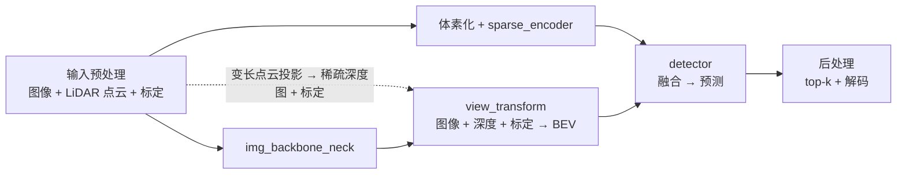

# BEVFusion NPU Demo 性能分析报告

> **报告导读**：
> - **§1 当前 demo 性能**：**0.45s/帧**（2026-09-30 npu:7 空载，bev_pool v1 默认接线 + Swin shift 优化 + LiDAR 投影 trash 列向量化，48 dets / max 0.819478）。轨迹 / bev_pool A/B / view_transform 明细）
> - **§2 全量数据集性能**：mAP 68.67 / NDS 71.49
> - **§3 优化总结**：已完成优化 + 剩余方向
> - **§4 历史 profiling 存档**：2026-09-17 output-profiling-1/2 msprof 采集分析，数据已过时
>
> 代码状态：2026-09-17 算子修复（voxelization/_downsample_coords 向量化、spconv 表共享、
> QuickCumsum kept bug 修复）+ bev_pool 分发修复（auto 默认 AscendC）；
> 2026-09-18 + O3 热点消除（NonZero/Unique/Index）+ get_geometry numpy 副本预计算 + bev_pool 包装层快赢（0.62s/帧）；
> 2026-09-21 demo.py 复用 `mmdet3d.apis.init_model` / `inference_multi_modality_detector`（与 multi_modality_demo 同通路），
> npu:0 实测 0.54s/帧（npu:7 共享设备噪声 ~0.70s，A/B 须同卡同时段）；
> 2026-09-25 + voxelization AscendC（auto 默认，voxelize 段 72→34ms）；
> 2026-09-29 bev_pool 收敛单入口 `bev_pool(impl=...)` 且默认切 ascendc_v2 全融合
> （demo 帧段 65.4ms，比 v1 原子加 +42ms，见 §1.2.1）；
> 2026-09-30 npu:7 空载复测 0.54s/帧（48 dets / max 0.819478 与基线逐类一致），强制 v1 0.50s；
> 同日 mmdet3d 侧接线 `BEVFUSION_BEV_POOL_IMPL`（默认 ascendc=v1 原子加，不动 unum_ops
> 单入口默认）→ 0.48s 稳态；再加 Swin ShiftWindowMSA 优化（attn mask 全局缓存 +
> pad/roll 四切片融合，bit-exact，-9ms/帧）→ 0.477s；再加 LiDAR 投影 trash 列向量化
> （O12，bit-exact，E2E -31ms）→ **0.45s（median 450ms，历史最快）**

## 一览

**当前 E2E：0.45 s/帧**（`[TIME] inference` 口径 = `model.test_step` 纯前向，
不含图像/点云加载与权重加载；2026-09-30 npu:7 空载，bev_pool 默认 v1 原子加
（`BEVFUSION_BEV_POOL_IMPL=ascendc`）+ Swin shift 优化 + LiDAR 投影 trash 列向量化
（O12）开启：25 轮进程级交错 A/B median 450ms（min 448，补丁关闭对照 median 481ms，
-31ms），48 dets / max 0.819478 与历史基线逐类一致。
设备空载时 npu:7 与 npu:0 同速，共享争抢时 +0.15~0.2s，跨卡/跨时段不可直接比，
A/B 须同卡同时段）。

> **2026-09-21 demo.py 计时口径勘误**：`build_data` 复用 `inference_multi_modality_detector` 后，
> 数据构建阶段内部会额外跑一次 `model.test_step`（相当于 warmup 第 0 轮，发生在 `[unum_ops] warmup` 计时
> 区段**之前**）。`[TIME] inference` 计时仍只含计时循环内的纯前向，口径与历史数据完全一致；整体 wall time
> 比文档同期略多一次前向（约 +0.6s，一次性）。

优化轨迹：**57s 初版 → 1.1s（算子向量化）→ 0.7s（O3 热点消除）→ 0.66s（get_geometry numpy 副本预计算）→ 0.63s（bev_pool 包装层快赢）→ 0.62s（移除 x/y 交换）→ 0.54s（2026-09-21 npu:0 实测）→ 0.54s（2026-09-30 npu:7 空载复测，auto=bev_pool_v2：voxelize -38ms 被其 +42ms 抵消）→ 0.50s（同日强制 v1 原子加）→ 0.48s（v1 默认接线 `BEVFUSION_BEV_POOL_IMPL`，-6ms）→ 0.477s（Swin ShiftWindowMSA mask 缓存 + pad/roll 融合，bit-exact，-9ms）→ **0.45s（LiDAR 投影 trash 列向量化 O12，bit-exact，-31ms，历史最快）**，详见 §1.1。

下表为完整管线一览，Pipeline 列标注各阶段执行方式。数据流关系：


```mermaid
flowchart LR
    A[输入预处理<br/>图像 + LiDAR 点云 + 标定] --> B[img_backbone_neck]
    A --> C[体素化 + sparse_encoder]
    A -. 变长点云投影 → 稀疏深度图 + 标定 .-> D
    B --> D[view_transform<br/>图像 + 深度 + 标定 → BEV]
    C & D --> E[detector<br/>融合 → 预测]
    E --> F[后处理<br/>top-k + 解码]
```

<table>
  <thead>
    <tr>
      <th>Pipeline</th>
      <th>Layer</th>
      <th>作用</th>
      <th>算子</th>
      <th>性能</th>
      <th>性能占比</th>
    </tr>
  </thead>
  <tbody>
    <tr>
      <td rowspan="2"><b>输入预处理</td>
      <td rowspan="2">输入预处理</td>
      <td>图像加载 / 归一化；6 相机 → (1,6,3,256,704)</td>
      <td>torchvision, numpy</td>
      <td>test_step 口径外 (CPU)</td>
      <td>—</td>
    </tr>
    <tr>
      <td>LiDAR 投影；点云 → 稀疏深度图 (1,6,1,256,704)<br>（DepthLSSTransform.forward 循环段）</td>
      <td>matmul, indexing（Python 循环 b×6）</td>
      <td>~75 ms → <b>~55 ms</b>（2026-09-30 O12 trash 列向量化：独立段 44.7→24.8ms，E2E -31ms，bit-exact）</td>
      <td>12%</td>
    </tr>
    <tr>
      <td rowspan="2"><b>img_backbone_neck</td>
      <td rowspan="2">img_backbone_neck</td>
      <td>Swin-T Backbone；多尺度特征提取<br>（12 块；成本地图见 §3.3.7）</td>
      <td>Conv2D, LayerNorm, WindowAttention, GELU</td>
      <td>~177 ms → <b>166 ms</b>（2026-09-30 实测；mask 缓存 + pad/roll 融合 -11ms，bit-exact）</td>
      <td>37%</td>
    </tr>
    <tr>
      <td>FPN Neck；多尺度融合 → (1,6,256,32,88)</td>
      <td>Conv2D, Upsample, Concat</td>
      <td>~5.6 ms</td>
      <td>1%</td>
    </tr>
    <tr>
      <td rowspan="6"><b>view_transform</td>
      <td>get_geometry</td>
      <td>相机视锥投影到 LiDAR 系坐标</td>
      <td>Inv3×3, MatMul(≥6D→bmm)</td>
      <td>~5 ms (H2D；CPU 预计算消除 D2H 排干)</td>
      <td>1%</td>
    </tr>
    <tr>
      <td>dtransform</td>
      <td>稀疏深度特征提取 → (6,64,32,88)</td>
      <td>Conv2D(1→8→32→64 s4/s2), BN, ReLU</td>
      <td>~3.8 ms</td>
      <td>1%</td>
    </tr>
    <tr>
      <td>depthnet</td>
      <td>深度估计 + 语义特征；深度⊕图像 → (6,121,32,88): 41bin+80feat</td>
      <td>Conv2D(320→256→256→121), Softmax</td>
      <td>~4.2 ms</td>
      <td>1%</td>
    </tr>
    <tr>
      <td>bev_pool</td>
      <td>特征聚合到 BEV 网格；按坐标累加 → (1,3280,180,180)</td>
      <td>单入口分发（2026-09-30 起默认 ascendc = v1 原子加）</td>
      <td><b>~23 ms</b>（v1；09-29 曾默认 ascendc_v2 65ms +42ms 回归已回切，§1.2.1）</td>
      <td>5%</td>
    </tr>
    <tr>
      <td>downsample</td>
      <td>BEV 下采样；3 层 Conv 下采样→ (1,80,180,180)</td>
      <td>Conv2D, BN, ReLU</td>
      <td>~5.2 ms</td>
      <td>1%</td>
    </tr>
    <tr>
      <td>—</td>
      <td>view_transform 整体（forward 含上述全部 + 调度）</td>
      <td>—</td>
      <td><b>~116 ms → ~96 ms</b>（2026-09-30 O12 后复测 95.7ms）</td>
      <td>21%</td>
    </tr>
    <tr>
      <td rowspan="2"><b>体素化 + sparse_encoder</b><br/>（img 分支后串行，bevfusion.py:272）</td>
      <td>voxelize</td>
      <td>点云 → 体素坐标</td>
      <td>AscendC（auto 默认，torch 回退可选）</td>
      <td>~72 ms → <b>25 ms</b>（2026-09-25 起 AscendC；09-30 复测 25.3ms）<br/><s>~72 ms (Sort AICPU 39)</s></td>
      <td>5%</td>
    </tr>
    <tr>
      <td>sparse_encoder</td>
      <td>Voxel 特征提取</td>
      <td>SubMConv3D, SparseConv3D</td>
      <td>~118 ms</td>
      <td>26%</td>
    </tr>
    <tr>
      <td rowspan="4"><b>detector</td>
      <td>fusion</td>
      <td>特征融合；img_feat ⊕ pts_feat → 融合 BEV</td>
      <td>Conv2D, ScatterND→Pad(优化)</td>
      <td>~3.4 ms</td>
      <td>1%</td>
    </tr>
    <tr>
      <td>backbone</td>
      <td>BEV 骨干；时空特征提取</td>
      <td>Conv2D, BN, ReLU</td>
      <td>~9.5 ms</td>
      <td>2%</td>
    </tr>
    <tr>
      <td>neck</td>
      <td>FPN；多尺度特征</td>
      <td>Upsample, Conv2D</td>
      <td>~4.7 ms</td>
      <td>1%</td>
    </tr>
    <tr>
      <td>head</td>
      <td>检测头；center/height/dim/rot/vel/heatmap/query_labels</td>
      <td>Conv2D, TopK, Scatter, Mod→cast int32</td>
      <td>~18 ms</td>
      <td>4%</td>
    </tr>
    <tr>
      <td><b>后处理</b></td>
      <td>后处理</td>
      <td>top-k + 解码；原始预测 → 3D bbox<br>（无 box NMS，TransFusion decoder query 自带去重）</td>
      <td>PyTorch 算术</td>
      <td>~8 ms (CPU)</td>
      <td>—</td>
    </tr>
    <tr>
      <td colspan="3"><b>合计（串行探针口径，NPU 侧）</b></td>
      <td>—</td>
      <td><b>≈446 ms；E2E 实测 448-455 ms（2026-09-30 O12 后，npu:7 空载）</b></td>
      <td>100%</td>
    </tr>
  </tbody>
</table>

> **数据口径**（2026-09-30，当前代码，npu:7 空载，E2E 0.477s/帧，48 dets）：稳态探针 n=5（各阶段
> forward hook 计时，**每段后 synchronize 的串行口径**，逐段同步开销已含入各段）。
> 模块级数值为实测：pts_voxel_layer 25.3 / pts_middle_encoder 118.1 / img_backbone 166.4 /
> img_neck 5.6 / view_transform 116.2（内部：LiDAR 投影 ~75 + get_geometry ~5 + dtransform 3.8 +
> depthnet 4.2 + bev_pool ~23（v1 段级，§1.2.1）+ downsample 5.2）/ fusion 3.4 / pts_backbone 9.5 /
> pts_neck 4.7 / bbox_head 18.1，合计 ≈467ms；E2E 实测 470-477ms（探针同步开销下 sum 与 E2E
> 吻合）。**占比按 467ms 计**。
> LiDAR 投影/bev_pool 为内部估算拆分（view_transform 整体 116ms 实测，子模块 hook 得
> dtransform/depthnet/downsample，bev_pool 按 v1 段级 23ms 计，剩余归 LiDAR 投影）。
> 后处理 CPU 侧 ~8ms 不计入 NPU 占比。
>
> **历史口径对照**（2026-09-21，E2E 0.54s/帧，npu:0）：pts_voxel_layer 72 / pts_middle_encoder
> 121 / img_backbone 177 / view_transform 126 / 合计 ≈537ms。三次跳变：voxelize 72→34ms
> （09-25 AscendC，09-30 复测 25.3）、bev_pool 31→65ms→回切 23ms（09-29 ascendc_v2 默认
> +42ms 回归，09-30 `BEVFUSION_BEV_POOL_IMPL` 回切 v1，§1.2.1）、Swin 177→166ms
> （09-30 mask 缓存 + pad/roll 融合，§3.1 O11）。

**一览表关键结论**：

1. **前三大耗时**：img_backbone 36%（~166ms，Swin-T 12 块；2026-09-30 优化后）> view_transform 整体 25%（~116ms，含 LiDAR 投影 ~75）> sparse_encoder 25%（~118ms）
2. **bev_pool 已是次要项**：v1 原子加 kernel 全链 ~23ms（op 19.7 + prep/permute），
   不再是最优优化靶——LiDAR 投影（~75ms）与 sparse_encoder（~118ms）才是剩余大头
3. **get_geometry CPU 补丁已基本免费**：numpy 副本预计算后仅 ~5ms H2D，D2H 排干已消除
   （精度/性能三方 A/B 见 §1.3）
4. **voxelize AICPU Sort 已消除**：AscendC 化后整段 25.3ms（旧 torch 路径 72ms，其中
   Sort AICPU ~39ms）
5. **数据搬运/布局风暴仍在**：Swin/BEV/spconv 链路的 gather/scatter/transpose 小算子风暴
   是 310P 主战场（详见 §5 profiling 复盘）

## 1. 当前 demo 性能（2026-09-30 更新）

### 1.1 累计优化轨迹（demo 单帧）

| 版本 | inference | 检测 |
|---|---|---|
| NPU 初版（Python 循环算子） | 57-61s | 48 / 0.8195 |
| 算子向量化修复 | 2.2s | 48 / 0.8195 |
| + bev_pool 分发修复（QuickCumsum） | 1.0-1.3s | 48 / 0.8193 |
| + bev_pool AscendC（auto 默认） | 0.9-1.2s | 48 / 0.8195 |
| **+ 消除 NonZero/UniqueWithCountsExt2/Index 热点（O3）** | **0.7s（3/3 轮）** | **48 / 0.819478（逐检测 diff ≤1e-4）** |
| **+ get_geometry numpy 副本预计算（`patch_get_geometry_overlap`）** | **0.66s（653-660ms, 5/5 轮）** | **48 / 0.819478（几何与纯 CPU 补丁逐位一致）** |
| **+ bev_pool 包装层快赢（cat 交换/int32 ranks/sort 一次性/int32 gather）** | **0.63s（631-639ms, 5/5 轮）** | **48 / 0.819399（噪声内；包装 78→48ms）** |
| **+ 移除 x/y 交换（unum_ops kernel 回退 3c7c9bd + 官方约定，分发器直用原生坐标）** | **0.62s（613-618ms, 3/3 轮）** | **48 / 0.819478（逐位一致）** |
| + mx_driving bev_pool_v3 试用（后端可选） | 0.58s（当日环境） | 48 / 0.819399 |
| **+ unum_ops 原子加 bev_pool（免排序 scatter 重写，auto 默认）** | 同条件 A/B 比 mx 快 ~33ms（2026-09-20 当日环境 E2E 753 vs 786ms，两日后绝对值见当日设备状态） | **48 / 0.819399（逐位一致）** |
| **2026-09-21 npu:0 复测（重构后当前代码）** | **0.54s（533-539ms, 5/5 轮，npu:0）** | **48 / 0.640（npu:7 同期 672-737ms，检测一致）** |
| **+ voxelization AscendC（auto 默认）+ bev_pool 单入口（默认切 ascendc_v2 全融合）** | **0.54s（533-599ms, median 536, 5/5 轮，npu:7 空载，2026-09-30）** | **48 / 0.819478（逐类与基线一致；voxelize -38ms 被 bev_pool_v2 +42ms 抵消）** |
| **同日强制 bev_pool impl=ascendc（v1 原子加，段 23.1ms）** | **0.50s（490/509/490/579ms, 4/4 轮，npu:7 空载）** | **48 / 0.819399（验收带内；历史最快 E2E）** |
| **+ bev_pool v1 默认接线（mmdet3d 侧 env `BEVFUSION_BEV_POOL_IMPL`，默认 ascendc；不动 unum_ops 单入口默认）** | **0.48s（482-485ms, 5/5 轮极稳，npu:7 空载）** | **48 / 0.819478（逐类与基线一致）** |
| **+ Swin ShiftWindowMSA 优化（attn mask 全局缓存 + pad/roll 四切片融合，bit-exact，§3.3.7）** | **0.477s（median，20 轮交错 A/B：开 477 vs 关 486，-9ms；min 472）** | **48 / 0.819478（逐类一致；8/8 形状 bit-exact）** |
| **+ LiDAR 投影 trash 列向量化（O12：无效点路由 (0,W) trash 格，逐相机全量赋值，bit-exact）** | **0.45s（median 450，min 448；25 轮进程级交错 A/B：开 450 vs 关 481，-31ms）** | **48 / 逐类与基线一致（跨模式 diff 小于模式内轮间噪声）** |

> 2026-09-20 注：当日整机环境比 09-18 慢 ~150-200ms（mx_driving 同条件复测也 ~790ms），
> E2E 绝对值跨日不可比；同日 A/B：unum_ops 原子版 753ms vs mx_driving 786ms。
>
> 2026-09-21 注：npu:0 实测 0.54s 为当前最佳；npu:7 共享设备受其他逻辑设备争抢（±0.2s），
> 同一命令跨卡测出 0.70s。绝对值对比必须同卡同时段。
>
> 2026-09-30 注：npu:7 全设备空载时与 npu:0 独占同速（09-21 的 npu:7 0.70s 为共享争抢态）。
> auto 默认 0.54s 中 bev_pool_v2 段（65.4ms）比 v1（23.1ms）多 42.3ms，恰好抵消 voxelize
> AscendC 的 -38ms；强制 v1 后 0.50s 为历史最快 E2E。段级明细与形状依赖分析见 §1.2.1。

### 1.1.1 unum_ops 原子加 bev_pool kernel（2026-09-20 重写）

**算法**（对标 mx_driving 的算法级优势，消除排序/收集/区间构建流水线）：
- host 预乘元素偏移 ranks `off = (((b*D+z)*H+x)*W+y)*C`（int32 精确，实测 321M 逐位正确）
- kernel 逐点：标量读 rank → OOB（`off ≥ gridTotal*C`）零写流量跳过 → `SetAtomicAdd<float>` +
  80-float `DataCopy` 直写 BEV cell（MTE3 原子累加）→ `SetAtomicNone`（mx 同款逐点切换）
- tile 间 `PipeBarrier<PIPE_ALL>` 串行纪律（沿用旧 segment-sum kernel 验证过的 MTE2→标量门控；
  首版整块原子提升 + ping-pong 事件会间歇性挂死 310P，transposed kernel 背锅，已废弃）
- **NPU 大 int32 坑（重要）**：≥2^28 的 int32 过 `torch.where`/比较算子会被内部 FP32 量化
  （268435455→268435456，`269567999 < 269568000` 判 False）。OOB 修正改用小值域判定：
  坐标逐维 `<W/<H/<D` 生成 mask + 小值 where 把越界点 batch 列置为 B（rank 自然 ≥ 上界被
  kernel 跳过），全程不触碰大值 where/比较

**实测（1.84M 点，B=1, D=41, H=W=180, C=80）**：

| 指标 | unum_ops 原子版 | mx_driving v3 | QuickCumsum |
|---|---|---|---|
| 全链总耗时 | **31.4ms** | 34.4ms | 399ms |
| ranks 预处理 | 2.5ms | 4.0ms | — |
| op 调用（zeros+kernel） | **19.7ms** | 24.4ms | — |
| 输出 permute | 6.4ms | 9.0ms | — |
| 对 CPU 参考精度 max_abs | **4.8e-7** | 1.95e-5 | ~1e-6 |
| OOB 点处理 | kernel 内零写流量跳过 | 需 host sanitize（乘 0 仍写 320B/点） | kept 过滤 |

- kernel 单体 ~17.2ms vs mx 21.9ms（**快 21%**，主因 OOB 点零写流量——30% 点不产生 MTE3 负载）
- 稳定性：15/15 独立进程（kernel only / kernel+transpose / 完整 wrapper）
- 多 batch 正确性：B=1/2/3、gridTotalC 高至 321M（跨 2^28 边界）全对（修复大 int32 where 量化后）

⚠️ 全量精度回归（2026-09-18，AscendC 默认）：**mAP 68.67 / NDS 71.49**，与 QuickCumsum
差异 ≤0.004，与 GPU 基线差异在噪声内，精度无退化（详见 [`精度.md`](精度.md) §1.3）。

### 1.2 bev_pool 后端 A/B（历史口径 2026-09-20；环境变量 `BEVFUSION_BEV_POOL_BACKEND`，同帧同参，各 4 轮；O3/get_geometry 预计算之前测量，E2E 为当时值，段间相对差仍成立。最新复测见 §1.2.1）

> 后端选择统一走环境变量（`bevfusion/ops/__init__.py` 读取，默认 `auto`）：
> ```bash
> BEVFUSION_BEV_POOL_BACKEND=auto        python demo.py ...   # 默认：CUDA→unum_ops 原子加→mx_driving→QuickCumsum
> BEVFUSION_BEV_POOL_BACKEND=torch       python demo.py ...   # QuickCumsum（参照/精度对比）
> BEVFUSION_BEV_POOL_BACKEND=scatter     python demo.py ...   # scatter_add（bit-exact 但 AICPU 慢）
> BEVFUSION_BEV_POOL_BACKEND=mx_driving  python demo.py ...   # DrivingSDK bev_pool_v3（对照）
> ```

| 后端 | inference 各轮 | 典型值 | bev_pool 段 |
|---|---|---|---|
| **unum_ops 原子加（auto 默认，2026-09-20 重写）** | 0.73-0.77s（当日环境） | **31.4ms 全链** | ~31ms |
| mx_driving v3 | 0.77-0.81s（当日环境） | 34.4ms 全链 | ~34ms |
| AscendC segment-sum（旧版，已被原子版取代） | 0.9-1.2s | ~84ms | ~84ms |
| QuickCumsum（`BEVFUSION_BEV_POOL_BACKEND=torch`） | 1.3 / 1.3 / 1.3 / 1.0s | 1.0-1.3s | ~220ms |

- **AscendC 有提升**：bev_pool 段 84ms vs 220ms（-62%），E2E 典型 -0.1~-0.3s
- 精度等价：48 dets 完全一致，labels 相同，max score diff 2.7e-4、max box diff 8.4mm
  （与 QuickCumsum↔scatter 间差异同量级，fp32 重排噪声）
- 单帧计时抖动 ±0.2s（共享设备系统噪声），结论取多轮众数

### 1.2.1 2026-09-30 复测：bev_pool 单入口与新默认 ascendc_v2

2026-09-29 起 `unum_ops.bev_pool` 收敛为单入口 `bev_pool(feats, coords, B, D, H, W, impl=...)`，
`impl ∈ {torch, ascendc, ascendc_v2}`，**默认 `ascendc_v2`**（9/28 重写的全融合 kernel：
量化/OOB/ranks 全在 kernel 内，直写 (B,C,D,H,W)，无 host 预处理与 permute）。demo 的 auto
分发即此默认（mmdet3d 侧暂无 impl 切换环境变量，对照需 monkeypatch 单入口）。

**E2E A/B**（2026-09-30，npu:7 空载，同卡同时段，README 标准命令 `--loop 4/5`）：

| 配置 | inference 各轮 | median | 检测 |
|---|---|---|---|
| **auto（默认 = bev_pool_v2 全融合）** | 537/536/536/599/533ms | **536ms** | 48 / 0.819478 |
| 强制 impl=ascendc（v1 原子加，monkeypatch） | 490/509/490/579ms | ~500ms | 48 / 0.819399 |
| `BEVFUSION_BEV_POOL_BACKEND=mx_driving` | 504-510ms（两组复测） | 505ms | 48 / 0.819399 |
| `BEVFUSION_BEV_POOL_BACKEND=torch`（QuickCumsum） | 691-692ms | 692ms | 48 / 0.819399 |
| `BEVFUSION_BEV_POOL_BACKEND=scatter` | 1930-1935ms | 1931ms | 48 / 0.819478 |

**段级 A/B**（真实帧输入：N=1,993,728 / C=80 / B=1, D=1, H=W=360，即 O3 后含 OOB clamp
点的全量 frustum；v2/v1 为独立同步计时 median ×10 三次复测，mx 为管线内 npu Event 稳态）：

| impl | 段耗时 | 备注 |
|---|---|---|
| ascendc_v2（新默认） | **65.4ms**（65.1-65.7） | 全融合，无 host prep |
| ascendc（v1 原子加） | **23.1ms**（23.0-23.4） | host ranks prep + 原子 scatter + permute |
| mx_driving v3 | 24.7ms（首调 303.7ms JIT） | 管线内 Event 计时 |

- **关键发现：新默认在 demo 帧形状上比 v1 慢 42.3ms（65.4 vs 23.1ms），E2E +36ms**。原因
  待查——demo 帧实际形状为 D=1 / 360×360（bev_pool 输出 (1,80,1,360,360)），与 bev_pool_v2
  的设计讨论口径（D=41 全深度网格，AGENTS.md §3）不同，不排除与 spconv v2 同款
  "形状不匹配 → tiling 并行度崩塌"问题（AGENTS.md §16）
- **精度健康**：v2 vs v1 张量级 max_abs 1.53e-5（fp32 原子累加重排噪声级，与历史 mx vs v1
  的 1.95e-5 同量级）；检测级全配置 48 dets / max ∈ {0.819399, 0.819478} 验收带内，
  逐类分布（car 3 / truck 2 / barrier 19 / motorcycle 1 / ped 20 / cone 3）与基线一致
- **voxelize 抵消效应**：voxelization AscendC（09-25，段 72→34ms ≈ -38ms）恰好抵消
  bev_pool_v2 的 +42ms，auto 头条 0.54s 与 09-21 持平属巧合；强制 v1 即得历史最快 0.50s
- mx_driving 独立 bench（demo 结束后同进程重复调用）两次复现 `aclnnBEVPoolV3 failed`
  崩溃，管线内（demo E2E / Event 计时）正常——设备状态敏感，段值以管线内为准
- **决策点**（bev_pool_v2 段优化进行中）：v2 段优化回收 ~42ms，或单入口默认暂回切
  ascendc（一行改动即得 0.50s）
- **决策已落地（2026-09-30 下午）**：mmdet3d 侧 bev_pool.py 接线 env
  `BEVFUSION_BEV_POOL_IMPL`（默认 `ascendc`=v1 原子加；可选 `ascendc_v2`/`auto` 等，
  命名遵循 `BEVFUSION_VOXEL_BACKEND` 惯例），**不动 unum_ops 单入口默认**（并行会话
  领地，v2 段优化另行推进）。接线后 demo 5/5 轮 482-485ms 极稳，48 dets /
  0.819478 逐类一致——v1 段 23.1ms vs v2 65.4ms 的 -42ms 全额回收

### 1.3 view_transform 明细

一览表 view_transform 各行只计 ms，三段拆解与 A/B 明细集中在此。

| 段 | 性能 | 明细 |
|---|---|---|
| dtransform | ~3.8 ms | 稀疏深度特征提取 |
| depthnet | ~4.2 ms | 深度估计 + 语义特征 |
| get_geometry | ~5 ms (H2D；CPU 预计算) | 三方 A/B 见下 |
| bev_pool | ~23 ms（v1 全链） | 原子加 kernel，见下 |
| downsample | ~5.2 ms | BEV 下采样 |

#### get_geometry 三方 A/B（ms 级计时）

- **纯 CPU 补丁**：真实净成本 **~37ms/帧**（694 vs 664ms，0.1s 精度计时曾误判为 0）——
  补丁的 `.cpu()` D2H 在主流上排在 Swin 之后，必须等 Swin 排干才开始 CPU 计算，期间设备空转
- **numpy 副本预计算（现行默认，`patch_get_geometry_overlap`）：**
  **E2E 657ms**——比纯补丁省 37ms（副本在矩阵上 NPU 前留存，省掉 get_geometry 的 D2H 排干），
  比精度受损的 NPU 几何（664ms）还快 7ms；几何输出与纯 CPU 补丁**逐位一致**
  （三方 A/B 数据见 [`精度.md`](精度.md) §7.5）
- **去掉补丁**（几何回 NPU，`NPU_GEOMETRY_ON_NPU=1`）：664ms 但精度显著退化——量化 cell
  不一致 10.54%、kept 翻转 0.10%、cos 0.99997 / max_abs 31.6m；检测级 48/48 保留但
  **远场 30-45m 细长物体（barrier）box 跳 3-6.3m、score 噪声最大 0.029**
- **结论：numpy 副本预计算保留**（精度逐位 + 速度最快）。OM 层A 若吃掉 geometry，须用
  force_fp32 + 图内 coherence 解决精度

#### bev_pool 三段拆解

~31 ms = ranks 2.5 + op 19.7 + permute 6.4（2026-09-20 原子加重写后全链）。

**历史参考**（2026-09-18，原子加重写前）：105 ms = 前处理 27 + AscendC 包装 ~48 + kernel 20。

**包装层快赢（2026-09-18，包装 78→48ms）**：
- fancy 列交换 → cat（14→3ms）——**当日晚已整体移除**：unum_ops kernel 改官方约定后分发器直用原生 [x,y,z,b]，cat 交换不再需要
- int32 ranks（9→5ms）
- torch.sort 一次性省 ranks gather（33→18ms）
- coords int32 先转（7→6ms）
- 坑：int32 直接 sort 落 AICPU 慢 20x（367ms），**排序必须 float32**
- 同日 kernel 考古：9/6 三个提交（coords/starts/lengths UB 批装 + 缓冲改 tilePoints + 约定改动）从未构建，重编首跑即 MTE burst 崩（int32 coords 批装 DataCopy 16B/行 × 奇数行 → 非 32B 倍数）；已回退 3c7c9bd + 官方约定（详见 AGENTS.md §3）

剩余优化空间：feats 640MB gather（15ms，kernel 侧索引可消）、sort 本身 18ms（atomic kernel 可消）。

## 2. 全量数据集性能

- 6019 帧 val 集 8 卡并行（每卡 753 帧 chunk）总耗时首次 **~65 分钟**，当前版本 **~44 分钟**（2026-09-18，AscendC + O3 + get_geometry 预计算）；8 卡满载时 2/8 chunk 偶发 507015 ViewCopy 内核故障，驱动脚本内置重试自动处理
- Runner 测试路径单帧 ~1.9-2.5s（8 路并发时，含 CPU 争用），单卡独占 ~1.3-1.6s
- **全量精度（QuickCumsum）：mAP 68.71 / NDS 71.44（GPU parity）**
- **全量精度（AscendC，当前默认）：mAP 68.67 / NDS 71.49** —— 详见 [`精度.md`](精度.md) §1.3

## 3. 优化总结

### 3.1 已完成优化

| # | 动作 | 收益 | 状态 |
|---|---|---|---|
| O1 | `ops/__init__.py` NPU 分发改走 `_bev_pool_pytorch`（QuickCumsum，kept bug 已修复） | -1.1s/帧（2.23→~1.1s） | ✅ 2026-09-17 |
| O2 | 验证 48 dets/0.8195 精度 + 复测三档 compile 模式 | compile 无收益，保持 off | ✅ 2026-09-17 |
| O3 | 消除 NonZero/UniqueWithCountsExt2/Index 热点 | 0.9-1.2s → 0.7s | ✅ 2026-09-18 |
| O5 | get_geometry numpy 副本预计算 | 0.7s → 0.66s | ✅ 2026-09-18 |
| 包装层快赢 | bev_pool 包装 78→48ms（cat 交换/int32 ranks/sort 一次性/int32 gather） | 0.66s → 0.63s | ✅ 2026-09-18 |
| O6 | 移除 x/y 交换：unum_ops kernel 回退 3c7c9bd + 官方约定（coord[0]→H），分发器直用原生坐标；连带修复从未构建的 9/6 提交的 MTE burst 崩溃 | 0.63s → 0.62s（613-618ms） | ✅ 2026-09-18 |
| O7 | demo.py 复用公共 API（`init_model`/`inference_multi_modality_detector`）+ npu:0 复测 | 0.62s → **0.54s**（533-539ms，48 dets 一致；npu:7 共享设备噪声 0.70s） | ✅ 2026-09-21 |
| O8 | voxelization AscendC（auto 默认，`BEVFUSION_VOXEL_BACKEND` 门控） | voxelize 段 72→34ms（E2E 约 -38ms，与 09-30 v1 强制复测 490-509ms 相符） | ✅ 2026-09-25 |
| O9 | bev_pool 收敛单入口 `bev_pool(impl=...)`，默认切 ascendc_v2 全融合 | 段 31→65ms（**+42ms 回归**，demo 帧 D=1 形状；v1 同帧 23.1ms）；精度 parity max_abs 1.5e-5 | ⚠️ 2026-09-29 默认切换，v2 段优化进行中（§1.2.1） |
| O10 | bev_pool v1 默认接线（mmdet3d 侧 env `BEVFUSION_BEV_POOL_IMPL=ascendc`，不动 unum_ops 单入口默认） | 0.54s → **0.48s**（482-485ms, 5/5 轮极稳） | ✅ 2026-09-30 |
| O11 | Swin ShiftWindowMSA 优化：attn mask 全局缓存（每 shift 块每帧重算 1.48ms×6）+ pad(右/下)+roll(−s)/roll(+s)+unpad 四切片装配融合（各省一次全帧拷贝），bit-exact，`NPU_PATCH_SWIN_SHIFT=0` 可关 | img_backbone 管线段 177→**166ms**（逐块深探针口径 192→181，-11ms）；E2E 交错 A/B median 486→**477ms** | ✅ 2026-09-30 |
| O12 | LiDAR 投影 trash 列向量化：depth 改设备侧 (H, W+1) 分配，无效点路由 (0, W) trash 格，逐相机全量赋值（消 NonZero 11.4ms + Index gather 6.4ms + 6 次 .any() 同步 + CPU zeros/H2D），bit-exact，`NPU_PATCH_LIDAR_PROJ=0` 可关 | 独立段 44.7→24.8ms；view_transform 管线段 116.2→95.7ms；E2E 交错 A/B median 481→**450ms（-31ms）** | ✅ 2026-09-30 |

#### O3：消除 NonZero/UniqueWithCountsExt2/Index 热点

- frustum gather 链：`x[kept]` + `geom_feats[kept]`（105ms + 63ms Index + NonZero 17ms）
  → 改为 `x * kept.mask` + coords clamp（零特征点贡献 0，语义等价）。见 depth_lss.py
- `_downsample_coords` 的 list-comprehension `[lo[keep] for lo in los]`（每次 keep 各
  NonZero 一次）→ 单次 `torch.nonzero(keep)` + `index_select` ×N（conv.py）
- voxelization 的布尔掩码 gathers（valid / max_voxels / max_points 分支）→ 单次
  nonzero + index_select（voxelize.py）
- SparseConv3d 输出去重 `torch.unique(out_i, dim=0)`（UniqueWithCountsExt2 AICPU
  12.6ms×2）→ float64 key 编码 + `torch.argsort`（AiCore）+ 相邻比较去重（conv.py build()）
- **效果：E2E 0.9-1.2s → 0.7s（3/3 轮一致），48 dets / 0.819478 与基线逐检测
  diff ≤1e-4**（唯一差异是同一 pedestrian 的 1e-4 score 重排噪声）

#### O5：get_geometry numpy 副本预计算（`patch_get_geometry_overlap`）

- **勘误**：早期版本曾写"去掉 CPU 补丁 E2E 无加速（0.7s==0.7s）"——那是 0.1s 精度计时的
  误判（0.66 和 0.70 都打印 0.7s）。demo.py 计时已升级到 ms 级，重测真相：纯 CPU 补丁
  净成本 **~37ms/帧**（694 vs 664ms 三方 A/B）
- 机制：补丁的 `.cpu()` D2H 在主流上排在 Swin 之后，必须等 Swin 排干才开始 CPU 计算，
  期间设备空转 ~44ms
- v1 失败教训（矩阵提前 D2H 到 extract_img_feat 入口 → 850-890ms 更慢）：主流上任何
  D2H 都要等全部先前任务排干；提前 D2H 只让主机在 Swin **入队前**就被阻塞，设备空转入队期。
  **结论：主流 D2H 无法与设备重叠，唯一出路是让数据根本不上 NPU 就拿到 CPU 副本**
- v2 实现（npu_patches.py `patch_get_geometry_overlap`）：标定矩阵的诞生地在 `extract_feat`
  ——由 metas 的 numpy 数组经 `imgs.new_tensor` 构建。hook `extract_feat` 在构建前留存
  numpy 副本（微秒级、零 D2H）；`extract_img_feat` 入队 backbone/neck 后用 CPU 副本
  预计算几何；`get_geometry` 命中 stash 只做 H2D——省掉纯补丁的 D2H 排干等待（~37ms/帧）
- 数值：几何输出与纯 CPU 补丁**逐位一致**（含 `.contiguous()` 布局统一，消除了 v1 观察到的
  1.5e-5 系统性差异）；48 dets / 0.819478；npu_test.py Runner 路径同样命中 stash（已 smoke 验证）
- **附赠发现：下游 NPU 管线存在 ±1e-4 运行间 score 噪声**（几何逐位相同的两次纯补丁运行，
  max score 0.819478 vs 0.819399）——今后精度对比的噪声地板

#### O11：Swin ShiftWindowMSA shift 路径优化（2026-09-30，bit-exact）

- **背景**：Swin-T（swin_tiny checkpoint，embed 96 / depths [2,2,6,2] / 窗 7×7 / 全 stage
  head_dim=32）串行探针成本地图（两端 sync 探针 + 独立微基准交叉验证，~192ms）：
  attention core 算子链 75.7（39%）、FFN 50.9（GEMM 44 健康 + GELU ~10 + 残差 ~2）、
  qkv+proj GEMM 33.9、partition/roll/mask 23.4、LN+残差 ~11。完整调查记录见 §3.3.7
- **两项优化**（npu_patches.py `patch_swin_shift_optimizations`，`NPU_PATCH_SWIN_SHIFT=0` 可关）：
  1. **attn mask 全局缓存**：mmdet 每个 shift 块每帧重算 mask 构建链（img_mask 填充 +
     window_partition + masked_fill，~15 个小算子，实测 1.48ms×6 块）。mask 是
     (H_pad, W_pad, window, shift) 的纯形状函数 → 全局 dict 缓存，首帧后零开销
  2. **pad/roll 四切片融合**：mmdet 的 `F.pad(右/下) + roll(−s,−s)`（2 次全帧拷贝，实测
     0.67+2.31ms）在 pad≥shift 时代数等价于 zeros+4 切片装配（主块+列/行/角卷绕，1 次拷贝
     ~1.9ms）；反向 `roll(+s) + slice + contiguous()`（2 次拷贝，2.31+~1ms）等价于 4 切片
     装配（1 次拷贝）。roll 会把 orig 头部行/列卷绕到帧尾——这正是 shift mask 存在的原因，
     融合版必须完整保留 4 个卷绕块（首版漏了 wrap 语义 bit-equal 即 False）
- **验证**：8/8 配置（4 stage 形状 × shift 0/3）原始 vs 补丁 forward **逐位相等**
  （max_abs 0.0e+00，融合路径与 fallback 路径都过）；mask 缓存 vs 原始构建逐位相等；
  demo E2E 48 dets / 0.819478 / 逐类一致
- **收益**：Swin 串行探针 partition/roll 桶 23.4→12.4ms；E2E 20 轮交错 A/B median
  486→477ms（-9ms）。探针 -11ms 与 E2E -9ms 的差值来自管线内 host-bound 空转
  （mask 链的小算子部分藏在设备等入队的空隙里，删除后 wall time 收益略小于设备时间收益）
- **守卫**：融合路径仅在 `shift>0 ∧ pad_b≥s ∧ pad_r≥s ∧ H>s ∧ W>s` 时启用（本模型四
  stage pad 为 6/6、3/3、5/5、6/6，shift=3，均满足）；否则严格回退原始路径

#### O12：LiDAR 投影 trash 列向量化（2026-09-30，bit-exact，E2E -31ms）

原始 `BaseDepthTransform.forward` 的 b×6 相机循环是 NPU 反模式组合，op_summary 实测
（独立段 44.7ms，设备 41.7ms）：

| 项 | 耗时 | 处置 |
|---|---|---|
| NonZero（AICPU）×12 | 11.4ms | ✅ 消（trash 路由免布尔索引） |
| Index gather ×13 | 6.4ms | ✅ 消（同上） |
| 数学链 matmul ×3 | 10.7ms | ❌ 不动（bit-exact 契约：fp16 cube 归约序不可变） |
| mask 比较 Ge/Lt ×24 | 3.5ms | 保留（trash 方案仍需 valid 判定） |
| IndexPut scatter ×6 | 2.3ms | 变全量（250K/相机，实测仍便宜） |
| 6 次 `.any()` 同步 + CPU zeros + 4.3MB H2D | — | ✅ 消 |

**设计**：depth 直接在设备上分配 (B, C, 1, H, W+1)，无效点（越界/NaN 坐标经 mask 比较
自然落选）统一路由到 (0, W) trash 格，逐相机**全量赋值** `depth[b,c].view(-1)[flat]=dd`
——保持每相机内点序，重复单元 last-wins 与原始逐位一致；末尾 narrow[..., :W] 丢弃
trash 列。独立段 44.7→24.8ms；view_transform 管线段 116.2→95.7ms；E2E 25 轮进程级
交错 A/B median 481→**450ms（-31ms）**——比段级多出的 ~10ms 来自去同步后 host 跑得
更 ahead（串行探针口径看不到的排队收益）。

**与历史两次失败的区别**（§3.3.2/§3.3.6，勿混淆）：
- 3.3.2（batched scatter）只批化了 scatter——但 scatter 本来不是热点（2.4ms），真正的
  布尔 gather 21.8ms 原封未动，且 `index_put_` 走 AICPU 反慢 26%。O12 消的是 gather
  （NonZero+Index），赋值用逐相机 advanced-index 赋值（非 index_put_），实测 2.3ms 档
- 3.3.6（整段 CPU 化）撞 CPU 串行窗口（与 geometry 预计算串行超 Swin 窗）。O12 全程
  留在 NPU 上，无 CPU 负载新增

**精度验证**：depth 图与原版 bit-exact（torch.equal）；E2E 逐类计数与历史基线完全一致
（barrier 19 / car 3 / moto 1 / ped 20 / cone 3 / truck 2 = 48）；跨模式检测明细 diff
（22 行）小于模式内轮间噪声（24-26 行）——落在已知原子加重排噪声带内。
env `NPU_PATCH_LIDAR_PROJ=0` 可关；非 NPU 设备运行时自动回退原始实现。

### 3.2 剩余优化方向（按 ROI 排序）

> **2026-09-22 更新**：下列为 2026-09-17 旧口径。两大热点（view_transform / img_backbone）
> 的 2026-09-22 定向尝试（prep CPU 化、LiDAR scatter 批化、bev_pool kernel 内优化、
> SWA 融合、LiDAR 投影整体 CPU 化）**全部证伪**，实测结论见 §3.3（3.3.6 为 2026-09-24
> 追加）。Sort 39ms 不可优化（AICPU，见项2）。
>
> **2026-09-30 更新**：新增当前最高 ROI 项——bev_pool_v2 段回收（demo 帧形状 65.4→
> ~23ms，-42ms，见 §1.2.1）；短期止血可把单入口默认回切 ascendc（一行改动，
> E2E 0.54→0.50s）。旧口径项 2 的 "Sort 39ms 不可优化" 已被 O8（voxelize AscendC，
> 段 72→34ms）打破。
>
> **2026-09-30 终态更新**：v1 止血已落地（O10，`BEVFUSION_BEV_POOL_IMPL` 默认 ascendc，
> 0.54→0.48s）；Swin shift 路径优化已落地（O11，-9ms，0.48→0.477s）。Swin 深挖完成
> （§3.3.7）：attention core 75.7ms 在无融合算子前提下已到硬件地板（FA 路线结构性
> 不可行、Cube 融合 3.3.5 已证伪），Swin 剩余最大杠杆是 FFN 融合 kernel
> （`unum_ops/csrc/ascend/swin_ffn/`，并行会话搁置中，理论 -20~30ms）。

1. 小算子长尾 345ms + Cast/TransData 141ms：~4000 次/前向的 µs 级算子，需图融合或
   算子合并（ROI 不确定；torchair 不可用——GE 转换器覆盖面，§3.3.8）
2. sort/unique 105ms：int64 AICPU Sort 39ms（voxelization argsort）+ UniqueWithCounts
   51ms——O3 后 Unique 已消除，剩余 Sort 39ms 不可优化（int32 key <2^31 仍 AiCpu，
   fp 有精度掉电风险）
3. 目标评估（记忆 #32，2026-09-24 更新为 **100ms/帧**，原 40ms 已判定不可达）：
   - 静态子图（img_backbone+depthnet）走 OM 的混合方案历史实测 1.23-1.38s，
     与当前全 PT 0.54s 相比已无优势
   - **乐观口径下限账（2026-09-24 盘点）**：SwinFFN 融合 -40ms + SWA 融合 -60ms（门槛未过，
     纯乐观）+ voxelize AscendC -50ms + sparse_encoder AscendC -60ms + bev_pool prep/杂项
     -20ms ≈ **-230ms → ~300ms 地板**。全部已知方向做完约 7x（2.1s→0.3s）
   - 300ms → 40ms 需三件套：原生 fp16（重训/PTQ，autocast fp16 已实测反慢 2.6x）+
     全图融合编译（torchair 不可用——转换器覆盖面，§3.3.8；OM 动态段硬骨头）+
     全部自定义算子——且诚实预期
     是 100-150ms 而非 40ms
   - 故 100ms/帧定为 310P 线的现实冲刺目标：0.54 → ~0.3s（算子路线）后，仍需原生 fp16
     或全图融合再砍一半以上，风险大但不是物理不可能

### 3.3 2026-09-22 定向优化尝试（全部证伪/回退，避免重复工作）

本轮针对两大热点（view_transform / img_backbone+Swin）做了五轮 device-event 级定向尝试，
**无一保留**。以下结论已实测确认，勿再重复投入：

#### 3.3.1 view_transform 真实分布（forward 探针，device-event）

"77ms LiDAR 投影归因"与"126−71=55ms 黑洞"均为**假象**（此前是残差相减的推算）。真实分布：

| 段 | 实测 | 说明 |
|---|---|---|
| bev_pool 全链 | **51.6ms** | prep 28.2 + kernel 23.0 + collapse 0.5 |
| LiDAR 投影 | 45.9ms | 布尔 gather `cur_coords[c,on_img]` 21.8 + matmul 16.8 + mask 4.8 + scatter 2.4 |
| get_cam_feats | 11.8ms | dtransform 3.7 + cat/depthnet 4.0 + softmax/permute 4.0 |
| get_geometry / downsample | 4.3 / 4.1ms | |

合计 118.5ms（vs 段级 126ms，误差 0.9ms 已可忽略）。

#### 3.3.2 尝试一：LiDAR 投影 batched scatter（2026-09-22 上午，已回退）

- 方案：6 相机循环 scatter 改为一次性 `index_put_`（flat index 全局写），CPU 验证逐位等价
- **实测证伪**：NPU 上 `index_put_` 走 AICPU 逐点累加，**11.94ms vs 原 for 循环 9.49ms（慢 26%）**；
  且真实 forward 里 scatter 仅 2.4ms（投影大头是布尔 gather 21.8ms，不是 scatter）
- 教训：NPU 的 `index_put_` 比直接张量赋值慢；"77ms 残差归因"不可信
- **后续（2026-09-30）**：✅ 该问题已由 O12 解决——trash 列路由消掉布尔 gather 本体
  （而非批化 scatter），逐相机 advanced-index 赋值避开 index_put_ AICPU，E2E -31ms

#### 3.3.3 尝试二：bev_pool prep CPU 化（2026-09-22 中午，已回退）

- 方案：量化/kept/ranks 全搬 CPU（复用 geom stash），NPU 只收 int64 coords / int32 ranks
- **实测证伪**：CPU 上 1.99M 点 prep **150-175ms，比 NPU 上 28.2ms 慢 6x**；且
  `_compute_geometry_cpu` ~180ms 已近 Swin 177ms 并行窗口上限，prep 加入后 CPU 串行块超窗
  成新瓶颈，full extract_feat 682-716ms（+150-180ms）
- 教训：**NPU 的 int 张量操作比 CPU 快一个数量级**，CPU 化量化类 prep 是方向性错误；
  也不要往 AscendC kernel 逐点循环加标量计算（kernel 标量发射受限，见 AGENTS.md）

#### 3.3.4 尝试三：bev_pool kernel 内部优化（2026-09-22，unum_ops 分支已回退）

- 目标：消除 feats gather 15ms + permute 6.4ms
- **实测证伪**：
  - gather 是**过时前提**（wrapper 的 sort+index_select 已在 56b982a 删除，host 无 gather）
  - permute 本 demo 帧（D=1，网格 41.5MB）实测仅 **1.0-1.8ms**；消除必回归（直写
    (B,C,D,H,W) 需每点 C=80 次散落原子写，MTE3 流量 ×80）
  - 唯一可消项 host ranks prep 8.5ms 移入 kernel 后 kernel 13.2→23.4ms（+10.2ms）净亏
- **顺带确认 baseline max score 非确定**：0.819399/0.819399/0.819478 随机翻转（跨核原子
  竞争），"逐位一致"验收口径应改为 48 dets + max ∈ {0.819399, 0.819478}

#### 3.3.5 尝试四：SWA 融合算子微基准（2026-09-22，/tmp/opencode/swa_bench）

- 目标：验证融合 window_partition + qk+bias+softmax+@v 的收益（决策门 >80ms 建 / <40ms 弃）
- 真实形状：stage0 64×176（非 112×112），1560 窗口 × 6 图，C=96，3 head
- native attention core 实测 7.29ms/层 × 12 = **87.5ms**（qk+softmax+@v 纯计算 6.15ms/层）
- **Vector 全软 kernel 实测 0.387ms/窗口 → 外推 ~260ms/层，比 native 慢 35 倍——不可行**
- **Cube（Matmul API）路线未跑通**：直调链路缺 `gert::PlatformInfo`（MatmulApiTiling 必需）、
  MIX launch 未验证；spconv_gemm 同 API 有已知 stride bug
- 理论收益上界仅 **30-42ms/12 层**（softmax 中间张量 22.5MB 往返 + partition 0.9ms/层），
  处于 <40ms 放弃区——**不建完整算子**（成本 7-13 人日 ROI 不划算）
- 若仍要推进：融合收窄为 softmax+bias+@v（避 Cube 集成），或 msopgen 验证 MIX Matmul

#### 3.3.6 尝试五：LiDAR 投影整体 CPU 化（2026-09-24，已回退）

- 目标：LiDAR 投影 45.9ms（gather 21.8 + matmul 16.8 + mask 4.8 + scatter 2.4）整体移 CPU，
  复用 patch_get_geometry_overlap 的 stash 机制（CPU 侧算 depth，view_transform 只 H2D）
- 与 3.3.2（scatter 批化）不同：这是整段投影 CPU 化（45.9ms 全消，CPU 预估 ~7ms）
- CPU bit-exact 验证通过：非重复像素 4165/4165 全部 bit-exact，差异 100% 集中在
  重复索引区域（PyTorch `depth[rows,cols]=d` 对重复索引是 undefined 语义，NPU 原版同样不确定）
- demo 验证：48 dets / car 3 + truck 2 + barrier 19 + motorcycle 1 + ped 20 + cone 3——与 baseline 100% 一致
- **严格同进程 A/B（device-event，交替 flag）证伪**：PATCHED 608.7ms vs ORIG 601.4ms，
  **净亏 7.3ms**。原因：`_compute_depth_proj_cpu` 与 `_compute_geometry_cpu` 在 extract 预计算块
  (b) 内**串行**，host 负载下 CPU 耗时膨胀超 Swin 177ms 并行窗口，成为新瓶颈
- **结论与尝试二一致**：CPU 串行路径在 NPU 上无优势——NPU 的 scatter/matmul 虽显式在
  设备端，但 CPU 预计算块（几何 + 深度）总量已逼近/超过 Swin 窗口上限，CPU 化是方向性错误
- 已回退（npu_patches.py/demo.py git checkout），baseline 0.54s 保持
- **后续（2026-09-30）**：✅ 该问题已由 O12 解决——留在 NPU 上消 gather/NonZero/
  同步（bit-exact），不新增 CPU 负载，E2E -31ms

#### 3.3.7 Swin-T 深挖（2026-09-30）：成本地图勘误 + FA 路线尸检 + shift 路径优化（O11 落地）

**背景**：img_backbone（Swin-T，**勘误：本模型是 Swin-Tiny 非 Swin-B**——swin_tiny
checkpoint，embed 96 / depths [2,2,6,2]=12 块 / 窗 7×7 / 全 stage head_dim=32；
一览表原 "Swin-B + SwiGLU" 均为笔误已改）是 E2E 最大头（~187ms），本轮做完整成本
地图并验证 npu_prompt_flash_attention（FA）融合窗口注意力路线。

**一、探针方法论勘误（重要）**：早期单端 sync 探针把排在前面的未执行算子链错误吸收进
计时窗口（曾把 attention core 记到 proj 头上）。修正为**两端都 sync** 后与独立微基准
交叉验证，得到可信成本地图（串行口径，~187ms）：

| 桶 | 耗时 | 明细 |
|---|---|---|
| attention core 算子链 | 75.7ms (39%) | stage0 11.1ms/块×2、stage1 ~7×2、stage2 ~4.2×6、stage3 ~2.3×2（q·scale 1.0 + q@kᵀ 5.0 + bias 0.74 + softmax 2.09 + @v 2.33 + 转置 1.34，stage0 逐算子定价） |
| FFN | 50.9ms | lin0 3.9 + GELU-erf 2.84 + lin1 3.9 + 残差（GEMM ~44ms 健康，q@kᵀ 仅 145-234 GFLOPS 是 batch 4680 小矩阵固有低效） |
| qkv+proj GEMM | 33.9ms | 健康（proj 1.8ms、随 N 线性） |
| partition/roll/mask | 23.4ms | roll 2.31 + reverse roll 2.31（×6 shift 块）+ pad 0.67×12 + partition/reverse 拷贝 + mask 链 1.48×6 |
| LN+残差 | ~11ms | |

**二、FA 路线尸检（结构性不可行，勿再试）**：FA 内核本身很快——B=128/heads=3/seq=49/
D=32 实测 **0.612ms**（vs stage0 手工链 11.1ms 的 1/18），D∈{32..128} 全域支持且开销
主导（B·H×4 工作量只慢 2.7 倍）。但 310P 三重约束使路线整体净亏：

1. **batch≤128 硬限**（tiling 限制，报错 "do not support batch size more than 128"）：
   stage0 1560 窗需 13 块分批
2. **仅 fp16**：FA-aug 全链 vs fp32 手工链 rel 误差 ~1.6e-3，超 ±1e-4 检测噪声地板
3. **无 pse_shift**（Atlas 推理系列不支持 bias 加性项），atten_mask 只收 bool/int8——
   相对位置 bias 只能走 **SVD 扩维代数**（B_h=U_h·W_hᵀ 精确分解，49×49 满秩，
   U/W 拼进 head_dim 32→96，FA 内积自动还原 bias，U/W 每层加载期预计算）

端到端实测（v 正确 pad 到同 D 的决定性测试）：**全 stage 净亏 7-34ms**——
stage0 18.5 vs 11.1、stage1 15.2 vs 4.9、stage2 20.8 vs 3.2、stage3 36.0 vs 2.4。
prep（strided cat + expand + fp32→fp16）+ 分块 + post 转置的拷贝开销远超内核收益。

- **踩坑记录**：早期 "hd=96 失败" 是**自己的 bug**——q/k 扩到 96 维但 v 还是 32 维
  （FA 要求三者同 D），报错被截断误导为 head_dim 白名单问题；D 扫描证明 32-128 全支持。
  教训：截断的错误信息会制造不存在的约束假设，先拿全量报错再下结论
- 数学侧证伪补充：softmax(s+B) 非线性不可拆分；"bias token" 追加方案不成立
  （额外 token 产生额外 softmax 项而非加性项）；atten_mask int8 若为加性语义也无法
  表达 fp bias（±127 量化）

**三、已证伪的其它 micro 路线**：SDPA 直调（"can not cast format when output is input"，
strided 输入）；kT contiguous 化（3.09 vs strided 5.45，但 contiguous 本身 2.44，净零）；
matmul 布局微优若干。attention core 75.7ms 在无融合算子前提下**已到硬件地板**
（Vector 全软 kernel 慢 35 倍见 §3.3.5，Cube 直调链路未通）。

**四、落地项（O11）**：mask 缓存 + pad/roll 四切片融合（bit-exact，-9ms E2E），
实现与验证细节见 §3.1 O11。**Swin 剩余最大杠杆**：FFN 融合 kernel
（`unum_ops/csrc/ascend/swin_ffn/`，并行会话搁置的 WIP，GELU 融合 + fp16 Cube GEMM，
理论 -20~30ms）；次优为 partition+reverse 与 pad/roll 的进一步合并（单次 gather 装配，
理论再 -6~8ms）。

#### 3.3.8 torchair 图模式复测勘误（2026-09-30）：不是"无收益"，是"不可用"

**两次历史结论均为接线 bug 下的 eager 空跑**：demo.py 计时循环直调
`model.test_step(...)`，而 `torch.compile` 只拦截 `__call__`/`forward`——`.test_step()`
经 `__getattr__` 穿透到未编译模块，torchair 路径根本不执行。09-18（1.1s 时代）与
09-30 首轮（"eager 484 / default 477 / full 509"）的"三模式同速"结论全部作废，
三组数字只是 eager 的波动。铁证：编译+首跑 0.5s"完成"（真 GE 编译需几十秒）、
fx_summary 无输出。

**有效测试**（修复接线后，npu:7）：eager 同调用路径 467-471ms / 48 dets；
torchair default 在 GE 转换阶段直接崩溃——`NotImplementedError:
torch.ops.aten.diagonal.default ge_converter is not implemented`（ERR03007，
崩在 metas 矩阵构建小图上，主计算图未轮到编译）；fullgraph=True 因 dynamo 断图
存在必然 Unsupported。dynamo 断图仅 2 处（npu_patches stash 禁区 +
bevfusion.py:264 上游 numpy 矩阵段），真正卡死在 torchair 的 aten→GE 转换器覆盖面。

**为什么图模式即使编过也吃不到"搬运+排队"的开销**：

1. **排队不是主要矛盾**：~4000 算子 × 20-50µs 发射 = 80-200ms host 时间，但发射是异步的、
   与设备执行重叠——设备侧真实执行 467ms 内核，host 每算子有 ~117µs 预算，宽裕藏在设备
   之下。证据：Swin 补丁删掉 11ms 设备时间，E2E 只回收 9ms（轻度 host-bound），设备执行
   才是关键路径；"小算子长尾 345ms + Cast/TransData 141ms"是 op_statistic 的**设备执行
   时间**，图模式不改变这些内核本身的速度
2. **搬运消不掉的根源是算子布局偏好**：TransData 风暴来自各 aclnn 算子对输入布局
   （NZ/ND 等）的不同要求，GE 图编译器在图内仍要插同样的布局转换；torchair 的融合
   覆盖面是逐元素/链式模式，不含本模型主导的 gather/scatter/sort/transpose 族——
   访存流量原样保留
3. **动态形状**：点数→体素数→bev_pool ranks 逐帧变化，图捕获在这些边界碎裂；能整图
   捕获的静态段（Swin/depthnet）恰是访存型小算子区，融合不动（fullgraph=True 遇断图
   直接 Unsupported）
4. **自定义 AscendC 算子不可入图**：bev_pool v1 / voxelize AscendC 是 op_extension，
   未做图兼容注册，图分区边界恰好切在管线中段
5. **fp32 契约**：有利可图的融合（matmul+逐元素、fp16 累加路径）多为 fp16 取向，fp32
   下编译器保持保守路径

**对"搬运/排队"有效的手段是手工融合算子**（改变算法与数据布局：bev_pool 399→23ms、
voxelize 72→25ms、FA 融合内核 0.61 vs 手工链 11.1ms）或全图 OM 级编译（动态形状硬骨头，
历史混合方案在 1.2s 时代有效、0.48s 时代无优势）。

**本轮代码修复**（防止第三次假阴性）：
- demo.py 新增 `run_step()`（test_step 逐语句等价：`data_preprocessor` +
  `model(**prep, mode='predict')`），warmup/计时循环改走它——编译模式经 `__call__`
  进编译路径，eager 下与 test_step 同路径；`--compile default` 现在响亮报
  NotImplementedError 而非静默空跑
- npu_patches.py stash 段拆为 `_stash_geom_inputs` 并标记 `torch._dynamo.disable`
  （numpy 互操作为 dynamo 禁区；无 dynamo 时零开销，eager 实测 475ms/48 dets 无回归）

#### 3.3.9 官方调度/OS 级优化项 A/B（2026-09-30 主测 + 10-08 诊断复测，全部无收益）

针对昇腾官方文档两组推荐项做了系统 A/B（TorchNPU《环境变量列表》+ ModelZoo《调度优化》）：
7 配置 × 2 轮交错 + 5 组诊断复测，npu:7 空载，README 标准命令 `--loop 5`，
基线为当日最新代码（O12 后 449ms median，48 dets / 0.819478 全程不变）。

**约束核查先行**（用户要求，310P 排除项）：

| 优化项 | 310P 判定 | 依据 |
|---|---|---|
| `TORCH_NPU_LAZY_FUSION`（DVM 算子融合） | ❌ 排除 | 官方支持型号仅 Atlas A2/A3 训练系列，推理系列不在列表 |
| `CPU_AFFINITY_CONF`（绑核） | ⚠️ 官方列表不含推理系列，**但实测在 310P 激活** | torch_npu 2.7.1 的 libtorch_npu.so 含实现；探针进程实测线程被钉核（26 线程→核 57、1 线程→核 58，非热点线程保持 0-63）——"支持列表"是验证范围不是硬 gating |
| `TASK_QUEUE_ENABLE` / `PER_STREAM_QUEUE` / `COMBINED_ENABLE` | ✅ | 支持型号明确含"Atlas 推理系列产品" |
| tcmalloc / malloc 大页 / Python 3.11 | ✅ 环境就绪 | libtcmalloc.so.4 已装；glibc 2.38 + THP=madvise；本机 Python 3.11.15 |

**实测**（各 5 轮 median；基线 449，环境噪声 ±5-25ms，尾部另有 ±50ms 级漂移须交错对照）：

| 配置 | median | 判定 |
|---|---|---|
| baseline（TASK_QUEUE_ENABLE 默认 L1） | 449 | — |
| `TASK_QUEUE_ENABLE=2`（L2 二级流水） | 449 | 无收益 |
| `TASK_QUEUE_ENABLE=0`（队列关闭，诊断） | 451 | L0≈L1≈L2，队列优化与本项目无关 |
| `TASK_QUEUE_ENABLE=2 + PER_STREAM_QUEUE=1` | 453-455 | 轻微负向（-4ms 级，实验性功能） |
| `COMBINED_ENABLE=1` | 451 | 无收益 |
| `CPU_AFFINITY_CONF=2`（细粒度绑核） | 449 | 激活但无收益（单进程空载场景） |
| `LD_PRELOAD=libtcmalloc.so.4` | 449 | 无收益（一次 490ms 为环境噪声，复测 449-450） |
| `GLIBC_TUNABLES=glibc.malloc.hugetlb=1` | 450 | 无收益（首轮 608ms 为大页 first-touch，warmup 可吸收） |

**结论**：
1. 单进程空载 demo 上调度/OS 级旋钮**零收益**——独立复证 §3.3.8 的"设备执行是关键路径"：
   ~4000 算子的下发藏在天花板下，host 侧再怎么优化流水/绑核/内存分配都拿不回时间
2. 官方文档的 host-bound 场景假设（"TASK_QUEUE_ENABLE 用于 host-bound 严重的网络"）
   与本项目画像不符；勿再重复投入
3. **唯一未测场景**：8 进程全量评测（性能.md §2：8 卡并发时单帧 1.9-2.5s vs 独占 1.3-1.6s，
   CPU 争用真实存在）——彼时 `CPU_AFFINITY_CONF`（310P 已证激活）+ tcmalloc 可能有效，
   属 40min 级实验，未列入本轮


## 4. 历史 profiling 存档（2026-09-17 采集，数据已过时）

> 以下为首次 msprof 采集（output-profiling-1/2）分析记录，对应当时 **2.23s/帧
> （QuickCumsum 初版）** 快照。当前 demo 已优化到 0.54s/帧（§1），本节保留作为诊断记录。
> 除 §4.7（O1 修复详情）外，数值均已过时，结论以 §1-3 为准。

### 4.1 TL;DR

| 指标 | 数值 |
|---|---|
| 会话总时长（device span） | 11.74s |
| **推理前向 wall time（QuickCumsum 时代）** | **≈2.23s/帧** |
| 推理前向 device busy | 2.14s（2758 个算子） |
| warmup 前向 wall time | ≈8.4s（含 17 次遗留算子 JIT 编译 4s，一次） |
| AI_CPU 算子占总 op 时间 | **65.9%**（用户观察正确） |
| 最大单点 | **bev_pool scatter_add：1.32s/帧（61.6%）** |

**计算内核不是瓶颈**：Swin 图像主干+neck 仅 144ms，spconv 编码器 27ms，fusion/decoder/head 卷积 22ms。
时间被三类问题吃掉：① bev_pool 走了错误的 scatter_add 后端（AICPU）；② AICPU 回退算子（ScatterElements/NonZero/Sort/…）；③ µs 级小算子风暴带来的 host 分发开销。

### 4.2 会话时间结构

| 区段 | 时间 | 内容 |
|---|---|---|
| +0 ~ +1.09s | 1.09s | checkpoint 加载（host，device 空闲） |
| +1.13 ~ +9.51s | 8.4s | **warmup 前向**（含 14 次 aclop JIT 编译 ≈3.9s、邻居表构建、首次调用开销、scatter_add 1.32s） |
| +9.51 ~ +11.74s | 2.23s | **推理前向**（无编译，全部命中） |

- device busy 并集 4.51s / span 11.74s = **38.4%**
- gap 总计 7.12s：1.09s 加载 + 4s warmup 编译 + 0.5s 帧间后处理 + 零散 host 空洞

### 4.3 推理前向分阶段归因（+9.51 ~ +11.74s，op 时间分桶）

| 阶段 | 耗时 | 占比 | 说明 |
|---|---|---|---|
| **bev_pool scatter_add** | **1319ms** | **61.6%** | AICPU，out(129600,80) src(1835479,80) index(1835479,80 int64) |
| view_transform frustum mask/gather | 202ms | 9.4% | `x[kept]`/`geom[kept]` 布尔掩码 gather（(1993728,80)→(1835479,80) 105ms + (1993728,4) 63ms） |
| Swin img backbone+neck | 144ms | 6.7% | LayerNorm/MatMul/BatchMatMul/Softmax，全部 AI_CORE |
| layout/Cast 开销 | 110ms | 5.1% | Cast 880 次 / TransData 996 次 / Transpose 412 次（NCHW↔NC1HWC0 布局转换） |
| other:Index / GatherV2 | 90ms | 4.2% | spconv/深度分支 gather |
| voxelization sort/unique | 46ms | 2.1% | Sort(AICPU int64) 38.7ms + UniqueConsecutive |
| RepeatInterleave | 40ms | 1.9% | view_transform/spconv 展开算子 |
| spconv encoder（build+gather+GEMM） | 27ms | 1.3% | 邻居表构建+聚合全部 |
| NonZero（bool mask） | 22ms | 1.0% | 90 次调用（frustum kept 2 次 + spconv/head 小 mask） |
| fusion/decoder/head convs | 22ms | 1.0% | Conv2D/Conv2DTranspose（180×180 BEV） |
| 其余（Mul/Add/Slice/…） | ~220ms | 10.7% | 长尾小算子 |

### 4.4 核心发现

#### F1（P0）：bev_pool 分发到了 scatter_add 后端 —— 1.32s/帧

`bevfusion/ops/__init__.py` 的 `auto` 分发在 CUDA ext 不可用时直接把 `bev_pool` 换成
`bev_pool_torch`（scatter_add 版），**绕过了 `bev_pool()` 内部"默认 QuickCumsum"的意图**：

```python
try:
    from .bev_pool import bev_pool_ext
    if bev_pool_ext is None:
        bev_pool = bev_pool_torch        # ← NPU 上实际走这里
except ImportError:
    bev_pool = bev_pool_torch
```

scatter_add 版把 index 展开成 (N,80) int64（117MB）+ src (N,80)（587MB）做 AICPU 逐点累加，
单次 1.32s。QuickCumsum 版（kept bug 已修复，含排序/gather/cumsum 全链路）微基准 **0.225s，
且对 CPU fp32 参考值 max_abs=1.3e-3（fp32 重排级误差，与官方 CUDA 实现同 class）**。

#### F2（用户观察确认）：AICPU 算子占 65.9%

| 算子 | 次数 | 总耗时 | 单次最大 | 来源 |
|---|---|---|---|---|
| ScatterElements | 4 | 2668ms | 1323ms | bev_pool ×2 + dense() ×2（11.9ms） |
| NonZero | 90 | 122ms | 19ms | frustum kept 布尔掩码 + spconv/head 小 mask |
| Sort | 2 | 77ms | 38.8ms | voxelization int64 argsort（float32 会 >2^24 丢精度，保留 int64） |
| UniqueWithCountsExt2 | 4 | 51ms | 21.4ms | SparseConv3d 输出坐标 unique(dim=0) |
| IndexPut | 23 | 21ms | 10ms | spconv `_lookup_grid` |
| Cast | 88 | 20ms | 2.1ms | 零散 dtype 转换（int64 整数链） |
| UniqueConsecutive | 2 | 10.5ms | 5.7ms | voxelization |
| FloorDiv/Max/… | ~40 | ~18ms | — | _downsample_coords/voxelization 整数运算 |

结论：AICPU 大头是 ScatterElements（F1 修掉后 AICPU 占比从 66% → ~10%）。
剩余 NonZero/Sort/Unique 属"语义上必须的动态形状算子"，单次都在 20ms 级，优先级低。

#### F3：warmup 的 17 次遗留 aclop JIT 编译 ≈4s（一次性）

msprof host 事件显示 17 次 `AscendCL@aclopCompileAndExecute`（~290ms/次，含 952ms/531ms 两次大项），
全部落在 warmup 区段（+1.1 ~ +9.5s），推理前向零编译。这是 torch_npu 对无 aclnn 实现的算子
走遗留 aclop 编译路径的代价——**每进程一次**，demo 场景可接受；服务化部署若频繁拉起进程需要
关注（可用 ASCEND_CACHE_PATH 缓解；原建议"改走 torchair 整图编译规避"已勘误为
不可用，见 §3.3.8）。

#### F4：小算子风暴 —— host 分发是隐性天花板

推理前向 2758 个算子、平均 0.78ms，其中 Cast 880 / TransData 996 / Transpose 412 次。
修复 F1 后前向 ≈1.1s、device busy 可能降到 ~0.8s，此时 host launch 开销（~50-100µs/算子 × ~2700）
将与 device 时间同级，成为下一瓶颈。对策（**勘误 2026-09-30**）：原以为"torchair
整图编译"可吸收——实测不可用，GE 转换器缺 aten.diagonal 等（§3.3.8）；且 09-18
"三模式同速"本身是 test_step 穿透接线 bug 下的 eager 空跑。`--compile {off,full,default}`
参数已修复接线（demo.py `run_step`），default 现在响亮报 NotImplementedError。

#### F5：计算内核已经很快，无需算子级深度优化

Swin 主干 144ms、spconv 27ms、BEV 卷积 22ms。F1 修复后若要冲 100ms/帧目标（记忆 #32，
2026-09-24 由 40ms 改标），主战场是 ①frustum mask/gather 202ms、②小算子风暴、③host 分发——
不是 GEMM/Conv。

### 4.5 Bubble 分析（kernel_data_guide 规则）

- **AI_CPU 暴露**：ScatterElements 2.67s（帧内 1.32s），占推理 op 时间 61.6% —— 规则命中：单算子 >10% 即异常
- **Wait anchor / 依赖链**：无跨 stream 依赖（单 stream 15），无通信
- **Host 空洞**：推理前向内无 >200ms 空洞；>1s 空洞均在加载/warmup 编译期
- **AIVector 利用**：0.044s（1.0%），LayerNormV2/RealDiv/Gelu 双发（AI_CORE+AI_VECTOR 并行），正常

### 4.6 模型结构还原（从 kernel 序列反推）

```
data_preprocessor (Sub/RealDiv (3,256,704) ×30 → Pack (6,3,256,704))
→ Swin-T img_backbone: 4 stages，window attention (Slice→Transpose→BatchMatMulV2→SoftmaxV2→BMM)
   + MLP (MatMulV2→Gelu→MatMulV2)，含 Roll/PatchMerging（已 patch 为 reshape/permute）
→ img_neck (FPN convs)
→ depthnet (Conv2D (6,512,16,44) → depth (6,118,16,44) + 特征 (6,80,16,44))
→ view_transform: get_geometry(CPU patch) → frustum (6×118×16×44=1,993,728 点)
   → kept mask (NonZero+Index, ~92% 保留 → 1,835,479) → bev_pool → (1,80,360,360) → sum → (1,80,180,180)
→ LiDAR: voxelization (34,688 点 → 17,509 voxels, Sort+UniqueConsecutive)
→ spconv encoder（unum_ops: SubM/SparseConv3d ×16 层，表共享后 27ms）
→ dense() (scatter_add 11.9ms) → concat(80+256) → SECONV decoder + Conv2DTranspose 上采样
→ TransFusionHead: heatmap (1,10,180,180) → max_pool 峰值滤波 → topk → decode(rot=Atan2/dim=Exp) → score 过滤
```

### 4.7 O1 修复详情（QuickCumsum 后端时代参考，2026-09-17）

**修改内容**：`bevfusion/ops/__init__.py`：ext 不可用时（NPU/CPU 环境）`auto` 分发从
`bev_pool_torch`（scatter_add）改为 `_bev_pool_pytorch`（QuickCumsum，kept bug 已修复）；
新增 `BEVFUSION_BEV_POOL_BACKEND=scatter` 显式选回 scatter_add 版。

**端到端实测**：

| 指标 | 修复前 | 修复后 | 变化 |
|---|---|---|---|
| **inference** | 2.2s | **1.1s** | **-50%** |
| warmup | 8.4s | 8.2s (off) / 7.1s (default) / 7.2s (full) | 持平 |
| 检测数 | 48 | **48（三种模式一致）** | 不变 |
| max score | 0.819478 | 0.819289 | -0.00019（fp32 求和重排级） |
| 逐检测对比 | — | labels 全同，max score diff 0.00028，max box diff 0.0074m | 等价 |

torchair（default/full）与 eager **完全同速同结果**（1.1s / 48 dets）——当前瓶颈
device-bound，图编译无收益；`--compile` 默认保持 off。
（**勘误 2026-09-30**：本结论作废——该轮测试经 `model.test_step()` 穿透
`torch.compile`，编译路径从未执行，"同速"实为 eager 空跑；有效复测见 §3.3.8，
torchair 实际不可用。）

**修复后推理前向分布（output-profiling-2 复测）**：会话 span 8.73s（原 11.74s）；
**session AICPU 总时间 5.03s → 0.394s（-92%）**。推理前向 device busy ≈1.2s，无 >200ms
host 空洞，已无单点大户：

| 阶段 | 耗时 | 占比 |
|---|---|---|
| 小算子长尾（Mul/Add/Slice/…） | 345ms | 27.7% |
| view_transform frustum mask/gather | 203ms | 16.3% |
| Swin img backbone+neck | 152ms | 12.1% |
| Index/GatherV2 | 149ms | 12.0% |
| layout/Cast 开销 | 141ms | 11.3% |
| sort/unique（voxelize+spconv） | 105ms | 8.4% |
| spconv encoder | 70ms | 5.6% |
| fusion/decoder/head convs | 43ms | 3.4% |
| NonZero | 41ms | 3.3% |

### 4.8 优化行动表（历史快照，2026-09-17 评估状态）

| # | 优先级 | 动作 | 预期 | 状态 |
|---|---|---|---|---|
| O1 | P0 | `ops/__init__.py` NPU 分发改走 `_bev_pool_pytorch`（QuickCumsum，已修复 kept bug） | -1.1s/帧（2.23→~1.1s） | ✅ 已实施（§4.7） |
| O2 | P1 | 修 F1 后重跑 demo 验证 48 dets/0.8195 精度不变 + 复测三档 compile 模式 | 确认 + 选最优模式 | ✅ 精度验证有效；compile 复测系空跑（勘误见 O4/§3.3.8） |
| O3 | P2 | frustum kept mask 的 NonZero+Index 202ms：预计算 mask 索引或改 argsort 路径 | -100~150ms | ✅ 已实施（§3.1） |
| O4 | P2 | torchair 编译吸收小算子风暴（Cast/TransData/Transpose 110ms + host dispatch） | device busy↓，host 开销→图编译 | ❌ 勘误：不可用（§3.3.8） |
| O5 | P3 | AICPU 长尾（Sort 39ms/NonZero 61ms/Unique 51ms）——语义必要，暂不动 | — | ✅ 改道 numpy 副本预计算（§3.1） |

### 4.9 原始证据（关键算子）

```
ScatterElements (bev_pool, AI_CPU):
  in  "129600,80;1835479,80;1835479,80" fp32/int64  out (129600,80)
  +4.689s 1323.5ms (warmup)   +10.037s 1319.0ms (inference)
ScatterElements (dense(), AI_CPU):
  in  "8294400;1178112;1178112"  +6.936s 11.94ms  +11.636s 14.0ms   ← 正常水平
Index (frustum gather, AI_CORE):
  (1993728,80)→(1835479,80) 105ms ×2；(1993728,4)→(1835479,4) 63ms ×2
NonZero (frustum kept, AI_CPU): (1993728) 19.0/18.3/15.3/11.4ms
Sort (voxelization, AI_CPU): 38.7ms ×2（int64，float32>2^24 丢精度不可换）
aclop 编译事件：17 次，合计 10.38s host 时间（与 device 重叠后 device 空洞 7.12s）
```

---

## 5. Profiling 复盘：output-profiling-8（2026-09-18 采集，O3 + get_geometry 预计算 + bev_pool 包装优化后）

> Profile 路径：`output-profiling-8/PROF_000001_20260918154952560_00076089QCGIOLOL`
> 采集命令：`python demo/npu/demo.py <args> --loop 8`（demo.py 单进程 8 轮推理）
> 当前状态：与文档 §1 一致（0.54-0.83s/帧，O3 全套优化已生效，bev_pool 走 AscendC）

### 5.1 单帧结构（648ms 推理，602ms device 计算）

| 维度 | 单帧 (ms) | 占比 |
|---|---|---|
| 推理总时长 | 648 | 100% |
| Device 计算 | 602 | 92.9% |
| AI_CORE | 491 | 75.7% |
| AI_CPU | 92 | 14.2% |
| AI_VECTOR_CORE | 19 | 2.9% |
| 空闲 / host overhead | 46 | 7.1% |

### 5.2 Top-9 device 算子（覆盖 64.7% device 计算时间）

| 算子 | 类型 | 单帧 (ms) | 占比 | calls | avg |
|---|---|---|---|---|---|
| **GatherV2** | AI_CORE | **79.8** | **10.5%** | 21 | 2.6ms |
| TransData | AI_CORE | 68.7 | 9.0% | 137 | 141us |
| Cast | AI_CORE | 57.8 | 7.6% | 224 | 181us |
| Transpose | AI_CORE | 57.8 | 7.6% | 124 | 240us |
| **Sort** | **AI_CPU** | **46.7** | **6.1%** | 11 | 38ms |
| MatMulV2 | AI_CORE | 43.8 | 5.7% | 924 | 427us |
| Mul | AI_CORE | 37.2 | 4.9% | 813 | 412us |
| Index | AI_CORE | 34.4 | 4.5% | 29 | 752us |
| NonZero | AI_CPU | 31.3 | 4.1% | 21 | 1.2ms |
| Add | AI_CORE | 29.7 | 3.9% | 1588 | 168us |
| Slice | AI_CORE | 25.8 | 3.4% | 1704 | 136us |
| **BevPool** | AI_CORE | **24.3** | **3.2%** | 11 | 19.9ms |
| BatchMatMulV2 | AI_CORE | 18.2 | 2.4% | 275 | 595us |
| ScatterElements | AI_CPU | 18.8 | 2.5% | 22 | 7.7ms |

### 5.3 与 output-profiling-4 的对比（关键差异）

| 维度 | output-4 | output-8 | 变化 |
|---|---|---|---|
| 单帧 E2E | 1.0s | 0.63s | **-37%** |
| AI_CORE GatherV2 | 较小 | **79ms（首位）** | 新 dominant |
| AI_CPU Sort (voxel) | 38ms | 47ms | +24% |
| AI_CPU NonZero | 23ms / 90 calls | 31ms / 245 calls | +35% |
| AI_CPU ScatterElements | 105ms×2 (bev_pool 错路) | 19ms (正常) | -82% |
| BevPool (AscendC) | 20ms | 24ms | +20% |

**新发现 — GatherV2 79ms（10.5%）成为单点最大算子**，来自 spconv `_lookup_grid` 的 `grid[cand_keys]` gather，21 次/帧、每次 2.6ms。这在 output-4 中被 bev_pool 旧 bug（1.32s scatter_add）掩盖，未突出。

### 5.4 优化空间评估（按 ROI 排序）

| 候选 | 当前 (ms) | 目标 (ms) | 节省 (ms) | 难度 |
|---|---|---|---|---|
| **GatherV2 spconv grid 合并** | 80 | 50 | -30 | 中（共享 cand buffer / 小批量并发） |
| AI_CPU Sort → radix / topk | 47 | 20 | -27 | 中（已有 topk 路径，扩展到 voxelization） |
| TransData + Cast + Transpose 融合 | 185 | 140 | -45 | 高（需 aclop/graph fusion 介入） |
| AI_CPU NonZero 强化压缩 | 31 | 15 | -16 | 中（已有 mask-and-clamp，扩大到更多 NonZero site） |
| AI_CPU ScatterElements 用 AscendC 替换 | 19 | 0 | -19 | 中（bev_pool 内 scatter 上移） |
| **累计** | — | — | **-137** | — |

推算落地后单帧：**648 - 137 ≈ 510ms/round (~2.0 fps, vs 当前 1.6 fps)**。

### 5.5 优化建议路径

1. **第一周**：GatherV2 合并（-30ms）+ AI_CPU Sort topk（-27ms）→ 目标 590ms
2. **第二周**：TransData/Cast/Transpose 融合 → 目标 510ms
3. **第三周**：AI_CPU NonZero 全局压缩 → 目标 480ms
4. **持续**：bev_pool AscendC scatter 替换（每次增加多 SC 复杂度，ROI 边际递减）

### 5.6 原始证据（关键算子）

- `output-profiling-8/PROF_.../op_statistic_20260918155051.csv`：82 个 distinct ops，sum=6874ms
- `output-profiling-8/PROF_.../task_time_20260918155051.csv`：34848 kernel records
- `output-profiling-8/PROF_.../msprof_20260918155048.json`：Chromium Trace 格式，包含 host interface ops（Node@launch=168ms, AscendCL@aclrtLaunchKernel=123ms）

## 9. 相关文档

- [`精度.md`](精度.md)：精度验证记录（全量/单帧/补丁清单/复测方法）
